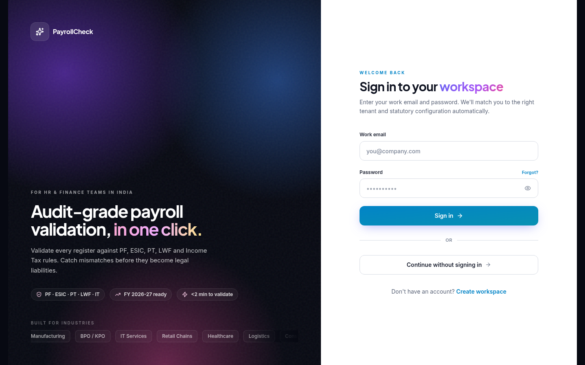
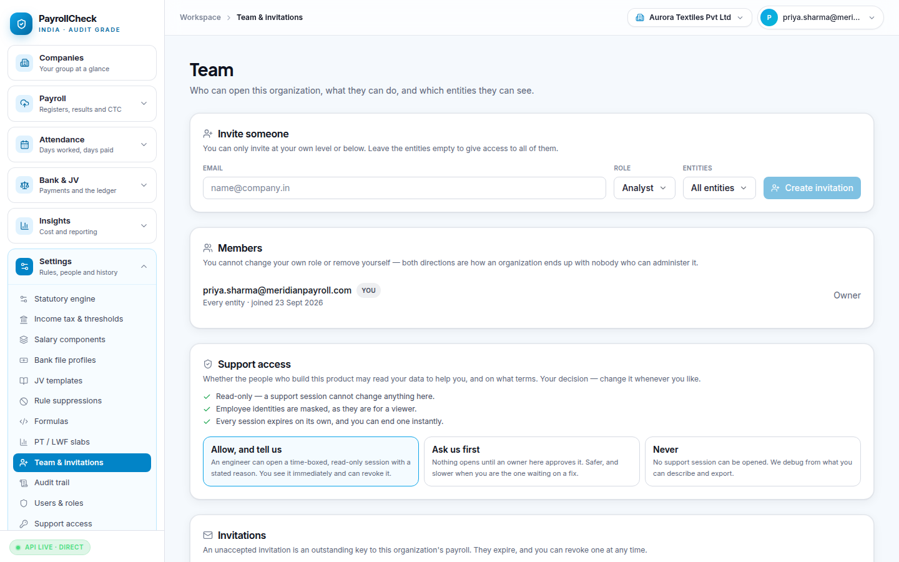
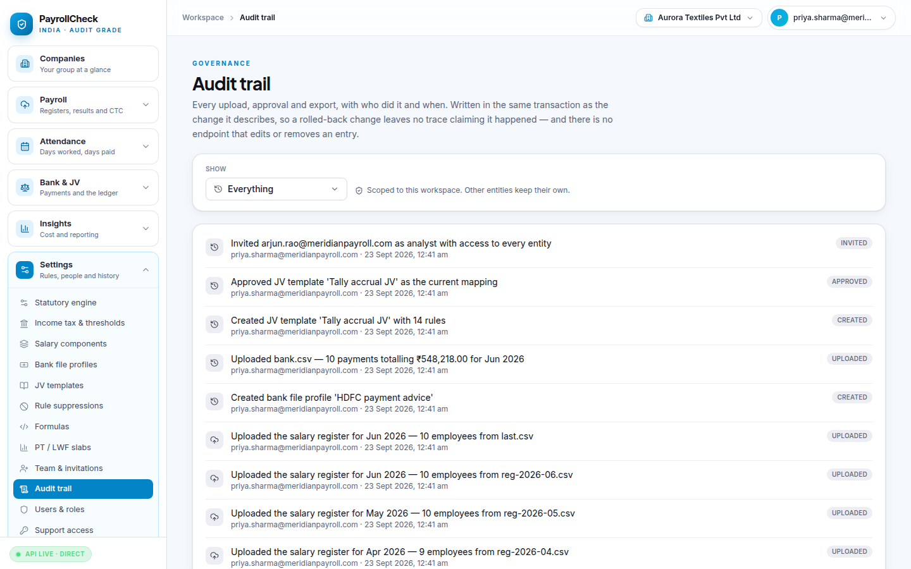

# PayrollCheck — Administrator Manual

Running the product: who can sign in, what each of them can do, how a client
account gets created, and how support access works.

Two different jobs are described here, and it matters which one you are doing:

- **Platform administrator** — you run PayrollCheck itself. You can see
  organizations exist. You cannot read their payroll.
- **Organization owner** — you run one client's account. You can see everything
  inside it and decide who else can.

---

## 1. The first account

On a fresh database, **the first person to sign up becomes the platform
administrator**. Everyone who signs up afterwards is an ordinary user.

```python
human_count = db.query(User).filter(User.email != SYSTEM_USER_EMAIL).count()
role = "admin" if human_count == 0 else "user"
```

> **Claim this seat before the site is reachable by anyone else.** There is no
> other way to become the first platform administrator — promotion requires an
> existing one, so if a stranger signs up first you are fixing it directly in
> the database.

---

## 2. The three kinds of login

There is **one sign-in page**. What you see afterwards depends on your platform
role and your organization role. There is no separate admin portal.



### Platform administrator (`user.role = "admin"`)

You. Adds two items to Settings — **Users & roles** and **Support access** —
and nothing else. Crucially:

**Being a platform administrator gives you no access to client payroll.** Entity
access is decided by organization membership, which never consults the platform
role. A standing developer login over every client's salary, PAN and bank data
would be the most attractive single target in the system, so it does not exist.

To see a client's data you open a support session (§6).

### Organization roles

Set per member, inside one organization:

| Role | Can do | Cannot do |
|---|---|---|
| **Owner** | Everything, including inviting owners, removing members, setting the support policy | — |
| **Manager** | Configuration, uploads, validation, sign-off, invite analyst/viewer | Change owners, set support policy |
| **Analyst** | Upload, validate, work findings, reconcile | Change configuration, manage people |
| **Viewer** | Read and export | Change anything |

Two rules hold regardless of role:

- **You cannot change your own role, or remove yourself.** Both directions are
  how an organization ends up with nobody who can administer it.
- **You can only invite at your own level or below.** An analyst cannot mint an
  owner.

### Entity access

Independently of role, a member can be narrowed to specific entities. Leave it
empty and they see every entity in the organization. This is how a practice
gives an analyst three client companies out of thirty.

---

## 3. Creating a client account

Two shapes, and the right one depends on who owns the data.

### A. The client owns their account (recommended)

1. The client signs up themselves at `/signup`, which creates their
   organization, their first entity, and their owner seat.
2. They add their remaining entities.
3. They invite their own people.
4. If they want your help, they set their support policy to allow it (§6).

Cleanest arrangement: the client's data belongs to the client's account, you
hold no standing access, and your entry is time-boxed and visible to them.

### B. You run it for them (a practice)

1. Your organization is set to `org_type = "practice"`.
2. You create **one entity per client company**.
3. You invite your own staff, narrowed by entity access to the clients they
   work on.
4. Client staff, if they need access, are invited as **viewer** and narrowed to
   their own entity.

Here the data lives in your organization. Be deliberate about that — it is a
commercial and contractual decision, not a technical one.

---

## 4. Inviting people

**Settings → Team & invitations.**



1. Enter the email.
2. Choose a role — your own level or below.
3. Choose entities, or leave empty for all of them.
4. **Create invitation.**

What you get back is a link, **shown once**. Only its SHA-256 fingerprint is
stored, so it cannot be recovered afterwards — resend to issue a fresh one.

Invitations expire after **7 days**. The email on the invitation must match the
email used to accept it; an invitation is not a general-purpose key.

> An unaccepted invitation is an outstanding key to this organization's payroll.
> Revoke any that are no longer needed rather than letting them expire quietly.

### Changing and removing

- **Change a role** — Members list. You cannot act on someone above your own
  level, or on yourself.
- **Remove a member** — revokes access immediately. Their audit history stays;
  removing someone must not erase what they did.
- The **last owner** cannot be demoted or removed.

---

## 5. Users & roles (platform)

**Settings → Users & roles**, platform administrators only.

Lists accounts in **your own organization**, plus any organization you currently
hold a live support grant on. It does not list every user on the installation —
a staff list is who a company employs, and enumerating one needs a grant, the
same as any other client data. Reads under a grant are written to that client's
audit trail as `support.read`.

You can promote and demote **within your own organization only**. A support
grant is read-only, so holding one does not put a client's accounts within reach
of promotion.

The last platform administrator cannot demote themselves.

---

## 6. Break-glass support access

The documented way for platform staff to read a client's data when the client
reports something that cannot be reproduced otherwise.

### What it guarantees

| Property | How |
|---|---|
| **Never implicit** | No grant, no access. Being platform staff is not access. |
| **Time-boxed** | Expiry stored on the grant; default 60 minutes, maximum 480. Expiry is derived, so a lapsed session stops working the moment it lapses. |
| **Reason-required** | Minimum 12 characters, stored, shown to the client. |
| **Read-only, always** | Recorded per grant, not decided at read time. |
| **Identities masked** | As they are for a viewer. Bugs live in configuration and totals, which masking leaves legible. |
| **Visible to the client** | Every open, use and close writes to *their* audit trail, not a staff log they cannot see. |
| **Revocable** | Instantly, by any owner there. |

### Opening one

**Settings → Support access** (platform side):

1. Choose the organization.
2. Write a real reason — "Investigating ticket 412, cost dashboard shows no
   June data". It is written to the client's audit trail.
3. Set a duration no longer than you need.
4. Open.

Under a `break_glass` policy it is active immediately. Under
`approval_required` it is `pending` until an owner there approves.

### What the client controls

On their own **Team & invitations** page, an owner sets the policy:

- **Allow, and tell us** (`break_glass`) — a session opens immediately; they see
  it at once and can revoke it. The default.
- **Ask us first** (`approval_required`) — nothing opens until an owner approves.
- **Never** (`disabled`) — no session can be opened. Switching to this **closes
  any session already open**; a policy that only applied to future sessions
  would not be the switch it appears to be.

While a session is live, a banner appears for **every member** of that
organization — not just owners — and it cannot be dismissed. Whoever the payroll
belongs to should be told, not only whoever can change the setting.

---

## 7. The audit trail

**Settings → Audit trail.** Append-only. Records configuration changes, uploads,
validation runs, finding decisions, sign-offs, invitations, member changes, and
every support session and use.



Audit rows are written in the same transaction as the thing they describe. A
trail that can survive a rolled-back change records events that never happened.

---

## 8. Routine administration

### Monthly

- Review open invitations; revoke stale ones.
- Review members against who still works there.
- Check the audit trail for support sessions you did not expect.
- Confirm sign-off completed for the closed period.

### Each financial year

- Re-verify every statutory rate against current notifications (§9).
- Review PT and LWF slabs per state.
- Review rule suppressions — a suppression made once should not become
  invisible forever. Waivers expire by default for the same reason.

### On a change of staff

- Remove the leaver's membership **before** their last day.
- Reassign entity access rather than sharing a login. There is no scenario in
  which two people sharing an account is the right answer in a system whose
  output is evidence.

---

## 9. What an administrator must not delegate

**Statutory rates must be verified by a payroll professional before real client
data is processed**, and re-verified every financial year. The shipped defaults
are FY-versioned and correct to the best of the build's knowledge, but Indian
payroll law changes by state, by notification and by year.

A validation engine that is confidently wrong is worse than none, because people
stop checking. See [`GO_LIVE.md`](GO_LIVE.md) §D6.
