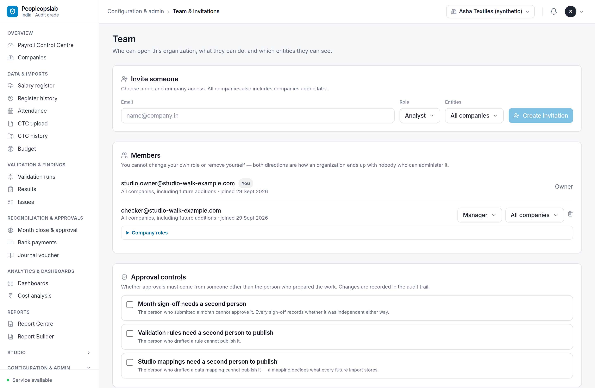
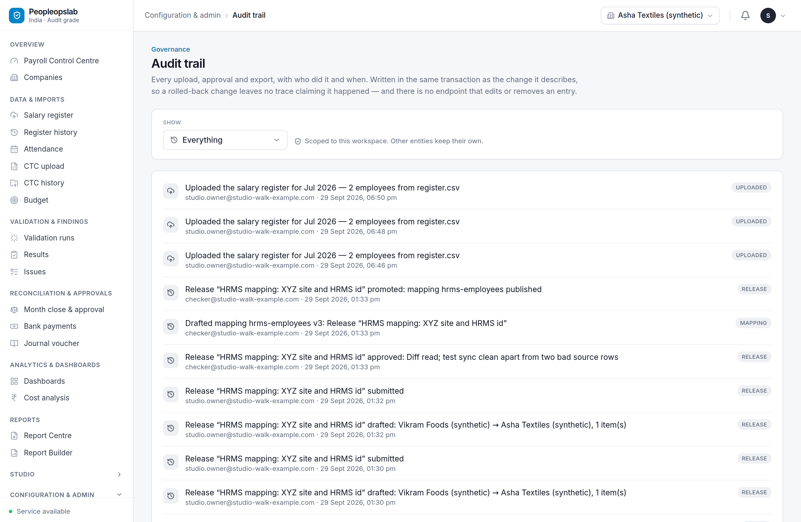
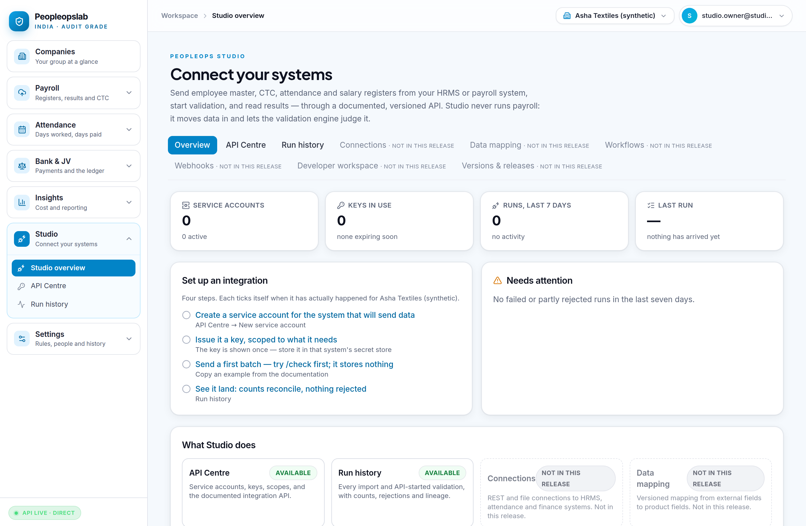

# Peopleopslab — Administrator Manual

Running the product: who can sign in, what each of them can do, how a client
account gets created, and how support access works.

Two different jobs are described here, and it matters which one you are doing:

- **Platform administrator** — you run Peopleopslab itself. You can see
  organizations exist. You cannot read their payroll.
- **Organization owner** — you run one client's account. You can see everything
  inside it and decide who else can.

---

## 1. The first account

Production has **no public signup**. `/api/auth/signup` answers 404, whatever
`ALLOW_PUBLIC_SIGNUP` says, and every account after the first arrives by
invitation. That leaves one question: how the first platform owner gets in.

**An installation upgraded from before platform roles** already has one: a
one-time migration names the legacy `role = "admin"` account as platform owner.
Nothing to do.

**A fresh database** — a new installation, a restore into an empty instance, or
the free-tier database being replaced when it expires — has nobody. From a
shell on a machine that can reach the database (on Render, the API service's
**Shell** tab):

```bash
cd backend
python -m app.bootstrap_owner you@yourdomain.in --site https://www.peopleopslab.in
```

It prints a one-time link to `/platform/join`. Open it within **24 hours** and
set your password. Deliberately narrow:

- **It only ever creates the first.** It refuses (exit code 2) once any platform
  owner or admin exists, so it cannot add a second owner or take over a
  platform someone else runs. Further staff are invited from the console (§2).
- **It never handles a password.** You set yours in the browser, so nothing
  secret lands in shell history or a deploy log.
- **It will not promote an existing account.** A client's login is never
  quietly turned into platform access; the first owner is always a new account.
- The link is the only copy of the token — only its hash is stored.

> Run it before you tell anyone the site exists, and open the link yourself.
> Until it is accepted, the link is the key to the whole platform.

---

## 2. The three kinds of login

Platform staff and client users are **separate populations with separate
sign-in pages.** A client account cannot sign in to the platform, a platform
account cannot sign in to a client workspace, and client credentials only work
at their own workspace's address.

| Who | Signs in at | Gets there by |
|---|---|---|
| Platform staff (owner, admin, support) | `/platform/login` | Invitation from a platform owner, accepted at `/platform/join` |
| A client's people | `/w/<workspace>/login` — e.g. `/w/acme-industries/login` | Invitation from the platform (the first owner) or from their own organization |
| Platform staff helping a client | Support session opened from the console | A time-boxed grant, §6 |

The same email and password at another workspace's address is refused with the
same message as a wrong password, so the sign-in page never confirms which
workspaces exist.


### Platform roles

| Role | Can do |
|---|---|
| **Owner** | Everything below, plus invite and remove platform staff |
| **Admin** | Create client workspaces, see which organizations exist, open support sessions |
| **Support** | Open support sessions only |

**No platform role gives access to client payroll.** Entity access is decided by
organization membership, which never consults the platform role. A standing
developer login over every client's salary, PAN and bank data would be the most
attractive single target in the system, so it does not exist.

To see a client's data you open a support session (§6).

### Organization roles

Set per member, inside one organization:

| Role | Can do | Cannot do |
|---|---|---|
| **Owner** | Everything, including inviting owners, removing members, setting the support policy and the approval controls | — |
| **Manager** | Configuration, uploads, validation, approving and reopening a month, invite analyst/viewer | Change owners, set support policy or approval controls |
| **Analyst** | Upload, validate, work findings, reconcile, submit a month for approval | Approve a month, change configuration, manage people |
| **Viewer** | Read and export | Change anything |

Two rules hold regardless of role:

- **You cannot change your own role, or remove yourself.** Both directions are
  how an organization ends up with nobody who can administer it.
- **You can only invite at your own level or below.** An analyst cannot mint an
  owner.

### Approval controls (maker–checker)

**Settings → Team & invitations → Approval controls.** Everyone can see them;
only an **owner** can change them, and each change is written to the audit
trail with the before and after.



| Control | When on |
|---|---|
| Month sign-off needs a second person | The person who submitted a month cannot approve it |
| Validation rules need a second person to publish | The person who drafted a rule cannot publish it |

Both are **off** by default, so a one-person practice can still close a month.
Whatever the setting, every sign-off records the preparer, the approver and
whether the approval was independent — so the record tells the truth either way.

Independent of the setting, a month **cannot be submitted or approved** when:

- it has no validation run;
- something the run read has changed since (register, master, attendance, CTC,
  configuration) — it must be revalidated;
- statutory checks could not be performed — unless the approver states why the
  gap is acceptable, which is kept in the sign-off record.

### Entity access

Independently of role, a member can be narrowed to specific entities. Leave it
empty and they see every entity in the organization. This is how a practice
gives an analyst three client companies out of thirty.

---

## 3. Creating a client account

Two shapes, and the right one depends on who owns the data.

### A. The client owns their account (recommended)

1. In the platform console (`/platform`), **Create client workspace** with the
   company name and the owner's email. You get back the workspace's sign-in
   address (`/w/<workspace>/login`) and a one-time invitation link
   (`/invite?token=…`), shown once.
2. Send the owner both. They open the invitation, set their password, and from
   then on sign in at their workspace's address.
3. They add their remaining entities.
4. They invite their own people.
5. If they want your help, they set their support policy to allow it (§6).

Cleanest arrangement: the client's data belongs to the client's account, you
hold no standing access, and your entry is time-boxed and visible to them.

### B. You run it for them (a practice)

1. Your organization is set to `org_type = "practice"`.
2. You create **one entity per client company**.
3. You invite your own staff, narrowed by entity access to the clients they
   work on.
4. Client staff, if they need access, are invited as **viewer** and narrowed to
   their own entity.

Here the data lives in your organization. Be deliberate about that — it is a
commercial and contractual decision, not a technical one.

---

## 4. Inviting people

**Settings → Team & invitations.**


1. Enter the email.
2. Choose a role — your own level or below.
3. Choose entities, or leave empty for all of them.
4. **Create invitation.**

What you get back is a link, **shown once**. Only its SHA-256 fingerprint is
stored, so it cannot be recovered afterwards — resend to issue a fresh one.

Invitations expire after **7 days**. The email on the invitation must match the
email used to accept it; an invitation is not a general-purpose key.

> An unaccepted invitation is an outstanding key to this organization's payroll.
> Revoke any that are no longer needed rather than letting them expire quietly.

### Changing and removing

- **Change a role** — Members list. You cannot act on someone above your own
  level, or on yourself.
- **Remove a member** — revokes access immediately. Their audit history stays;
  removing someone must not erase what they did.
- The **last owner** cannot be demoted or removed.

---

## 5. Users & roles (platform)

**Settings → Users & roles**, platform administrators only.

Lists accounts in **your own organization**, plus any organization you currently
hold a live support grant on. It does not list every user on the installation —
a staff list is who a company employs, and enumerating one needs a grant, the
same as any other client data. Reads under a grant are written to that client's
audit trail as `support.read`.

You can promote and demote **within your own organization only**. A support
grant is read-only, so holding one does not put a client's accounts within reach
of promotion.

The last platform administrator cannot demote themselves.

---

## 6. Break-glass support access

The documented way for platform staff to read a client's data when the client
reports something that cannot be reproduced otherwise.

### What it guarantees

| Property | How |
|---|---|
| **Never implicit** | No grant, no access. Being platform staff is not access. |
| **Time-boxed** | Expiry stored on the grant; default 60 minutes, maximum 480. Expiry is derived, so a lapsed session stops working the moment it lapses. |
| **Reason-required** | Minimum 12 characters, stored, shown to the client. |
| **Read-only, always** | Recorded per grant, not decided at read time. |
| **Identities masked** | As they are for a viewer. Bugs live in configuration and totals, which masking leaves legible. |
| **Visible to the client** | Every open, use and close writes to *their* audit trail, not a staff log they cannot see. |
| **Revocable** | Instantly, by any owner there. |

### Opening one

**Settings → Support access** (platform side):

1. Choose the organization.
2. Write a real reason — "Investigating ticket 412, cost dashboard shows no
   June data". It is written to the client's audit trail.
3. Set a duration no longer than you need.
4. Open.

Under a `break_glass` policy it is active immediately. Under
`approval_required` it is `pending` until an owner there approves.

### What the client controls

On their own **Team & invitations** page, an owner sets the policy:

- **Allow, and tell us** (`break_glass`) — a session opens immediately; they see
  it at once and can revoke it. The default.
- **Ask us first** (`approval_required`) — nothing opens until an owner approves.
- **Never** (`disabled`) — no session can be opened. Switching to this **closes
  any session already open**; a policy that only applied to future sessions
  would not be the switch it appears to be.

While a session is live, a banner appears for **every member** of that
organization — not just owners — and it cannot be dismissed. Whoever the payroll
belongs to should be told, not only whoever can change the setting.

---

## 7. The audit trail

**Settings → Audit trail.** Append-only. Records configuration changes, uploads,
validation runs, finding decisions, sign-offs, invitations, member changes, and
every support session and use.



Audit rows are written in the same transaction as the thing they describe. A
trail that can survive a rolled-back change records events that never happened.

---

## 8. Routine administration

### Monthly

- Review open invitations; revoke stale ones.
- Review members against who still works there.
- Check the audit trail for support sessions you did not expect.
- Confirm sign-off completed for the closed period.

### Each financial year

- Re-verify every statutory rate against current notifications (§9).
- Review PT and LWF slabs per state.
- Review rule suppressions and switched-off rule packs (Settings → Validation
  matrix) — a suppression made once should not become invisible forever.
  Waivers end by themselves for the same reason (90 days unless a date is
  given, at most 366) and reopen their finding when they lapse.

### On a change of staff

- Remove the leaver's membership **before** their last day.
- Reassign entity access rather than sharing a login. There is no scenario in
  which two people sharing an account is the right answer in a system whose
  output is evidence.

### The validation queue

Validations run as background jobs inside the API service, drained by worker
threads that start with it.

| Setting | Default | Meaning |
|---|---|---|
| `VALIDATION_WORKER_ENABLED` | `true` | Start worker threads in the API process. Turn off **only** if a separate `python -m app.worker` process runs instead — otherwise every validation waits forever. |
| `VALIDATION_WORKER_CONCURRENCY` | `1` | Threads per process. Each holds one validation in memory; see the measured figures in `docs/BACKGROUND_JOBS.md` §15 before raising it on a small instance. |

**A job whose worker died** (a deploy, the instance sleeping, out of memory) is
reclaimed automatically once its lease is two minutes stale, and retried up to
three attempts. Nothing to do.

**A job that failed** shows its reason on the client's progress page, written
for them (missing columns, no components configured). The raw error is kept in
`validation_jobs.error` for you; the client never sees it. A retry is a new job
and is always safe — a failed attempt writes nothing.

**A job stuck in `queued`** means no worker is running. Check the API boot log
line `validation_workers=N`; `0` means the setting is off.

### Run history and storage

Validation runs are **never deleted**: re-validating a month supersedes the
previous run and keeps it. Uploads are kept too, with the rows as parsed,
compressed. Budget the database for it — measured sizes per 1,000 employees are
in `docs/BACKGROUND_JOBS.md` §15. There is no purge; removing evidence is a
decision for the client, not a housekeeping task.

### Upgrading to the run-history release (October 2026)

- **Automatic on first start.** `preserve_run_history` in `app/migrations.py`
  adds columns to `validation_runs` and `validation_jobs`, creates
  `register_uploads` and `validation_run_employees`, and adds a unique index
  allowing one `current` run per period. It is idempotent and additive.
- **Existing runs** become run 1, `current` — true of every one, because the old
  code deleted the previous run on each re-validation. They carry no input
  digests, so they are reported as *"predates input tracking"* rather than as
  current; revalidating the month gives them a successor with full evidence.
- **Rollback:** redeploy the previous release. Every new column is nullable or
  defaulted and the old code does not read them, so it runs unchanged. Runs made
  by the new release stay in the table (the old code would show only the latest
  per month, as before). The one thing the old code does that the new one
  undoes is *delete* superseded runs on the next re-validation — so roll back
  only if you must.

### Upgrading to the coverage and approval release

- **Automatic on first start.** `organizations.approval_policy` and two count
  columns on `validation_run_employees` are added by the idempotent column
  patches and `preserve_run_history`; nothing is rewritten.
- **Months validated before the run-history release cannot be approved until
  revalidated.** Their inputs were never fingerprinted, so they cannot be shown
  to be current, and approval is refused with that reason. Re-upload the
  month's register and validate it; that run carries full evidence and coverage.
  The same applies to a month left *Submitted* across the upgrade: approving it
  re-checks readiness.
- **Runs made before this release** show "coverage was not recorded" rather
  than a coverage figure. They are not treated as fully covered.
- **Per-employee exposure** now counts overlapping findings once, as the run
  total always did from the run-history release; older runs keep the figures
  they recorded.
- **Rollback:** redeploy the previous release. The new column is nullable and
  unread by the old code. Sign-offs made under the new rules stay valid records.

### Upgrading to the issues release

- **Automatic on first start.** `track_finding_work` adds `owner_user_id` and
  `due_date` to `finding_states`; `finding_comments` and `finding_attachments`
  are new tables. Additive and idempotent.
- **Waivers now always end.** New waivers get 90 days unless a date is given
  (at most 366); a lapsed waiver reopens its finding with a recorded event, and
  a sign-off lists it as outstanding, not accepted. **Existing waivers with no
  end date are not rewritten** — nobody chose a date for them — and the Issues
  page flags each one "no end date — review". Ask the client to re-waive them
  with a date or reopen them.
- **Resolving a finding by hand now needs a reason**, like waiving always did.
- **Evidence files** are stored in the database (5 MB each, PDF, PNG, JPEG,
  XLSX, XLS, CSV or text, content checked against the extension). Budget for
  them alongside run history.
- **Rollback:** redeploy the previous release. The new columns are nullable and
  the new tables are unread by it; waivers it sees keep their end dates.

### Upgrading to the rule-engine release

- **Automatic on first start.** `extend_validation_rules` adds `applies_to`,
  `on_missing` (default `cannot_validate` — what every existing rule already
  did), `editor_mode`, `cloned_from_id`, `retired_at`, `retired_by` and
  `retire_reason` to `validation_rule_versions`. Existing rules behave exactly
  as before.
- **New status `retired`.** A retired version still governs the months before
  its end date. Rolling back to the previous release makes retired versions
  stop applying altogether (the old code only reads `published`).
- **Publishing can now be refused** for a contradiction with a published rule
  or a reference to a component that is no longer configured.
- **Copying** rules between companies needs owner or manager on every target;
  configuration copies need write access here and read access to the source,
  within the same organisation. Both write to both companies' audit trails.
- **Rollback:** redeploy the previous release; the columns are ignored by it.

### Upgrading to the BI and dashboards release

- **Automatic on first start.** `dashboards` and `custom_kpis` are new tables
  (`create_all`); nothing existing changes shape.
- **Cost per head changes meaning.** It was the range's total CTC ÷ distinct
  people — an annual figure over a year, inflated by every joiner and leaver,
  under the same label as the monthly chart beside it. It is now average monthly
  cost per head: CTC ÷ person-months, on the page, in the management summary and
  in dashboards. Expect the headline to fall for multi-month ranges; tell clients
  who compare it with earlier exports.
- **Arrears runs no longer replace the month's register.** Registers already
  overwritten by an arrears upload stay as they are; re-upload the regular
  register for those months to restore their cost.
- **Budget vs actual**: a budgeted month with no register now has no actual
  and is excluded from the totals, instead of showing ₹0 and a full underspend.
- **Rollback:** redeploy the previous release; the two tables are ignored by it.

### Upgrading to the Studio release (integration API)

- **Automatic on first start.** Five new tables (`studio_service_accounts`,
  `studio_credentials`, `studio_runs`, `studio_run_rejections`,
  `studio_idempotency`) arrive through `create_all`; the `record_import_lineage`
  migration adds a nullable `lineage` column to `employee_records`,
  `attendance_rows` and `ctc_records`. Lineage is excluded from validation input
  digests, so no existing run turns stale.
- **Upload screens now name duplicates.** Committing a master or attendance file
  with an employee twice still keeps the first row, and now says which ids were
  skipped (`duplicates_skipped`) instead of dropping them unseen.
- **The worker also processes Studio imports.** A deployment with
  `VALIDATION_WORKER_ENABLED=false` and no `python -m app.worker` leaves API
  imports queued; the Studio overview says so.
- **Four new settings**, all with safe defaults: `INTEGRATION_RATE_LIMIT_PER_MINUTE`,
  `INTEGRATION_MAX_REQUEST_MB`, `INTEGRATION_MAX_RECORDS`,
  `STUDIO_REJECTION_RETENTION_DAYS`.
- **Rollback:** redeploy the previous release. It ignores the new tables and
  column; issued keys stop working with the integration API gone.

---

## 8b. PeopleOps Studio — keys for other systems

A client's HRMS, attendance or payroll system can send data and read results
through the integration API (`/api/integration/v1`). It does so as a **service
account**, never as a person.



**Who may do what.** Owners and managers create service accounts and keys,
only for companies they manage. Analysts see Studio's run history. Viewers do
not see Studio. Platform staff have no access to a client's Studio beyond a
break-glass grant, which is read-only as everywhere else.

**What a key can never do**, whatever scopes it holds: publish a validation
rule, waive or resolve a finding, submit or approve a month, change who has
access. Those stay with people, and maker–checker still applies to rules a key
proposes — the key is the preparer, so any owner or manager may approve.

**Routine care**

- One service account per sending system, so one can be revoked without
  stopping the others.
- Keys expire (90 days by default, at most a year). The Studio overview lists
  keys expiring within 14 days. **Rotate** with an overlap long enough for the
  other system to switch (24 hours by default).
- **Revoke** at once when a key may have leaked — a ticket, a chat, a log. It
  stops on the next request. Disabling the account stops all its keys.
- A key found somewhere it should not be can be identified by its prefix
  (`pol_live_1a2b3c4d`) in Studio → API Centre without anyone knowing the
  secret. The product stores only a fingerprint and cannot show a key again.
- Rejected records are kept for 30 days for inspection and retry; viewing one
  is written to the audit trail.

Every account change, key issue, rotation, revocation and every import a key
submits is in the audit trail.

---

## 9. What an administrator must not delegate

**Statutory rates must be verified by a payroll professional before real client
data is processed**, and re-verified every financial year. The shipped defaults
are FY-versioned and correct to the best of the build's knowledge, but Indian
payroll law changes by state, by notification and by year.

A validation engine that is confidently wrong is worse than none, because people
stop checking. See [`GO_LIVE.md`](GO_LIVE.md) §D6.
