# Peopleopslab — User Manual

For the people who use Peopleopslab each month: payroll, HR and finance staff at
a client company.

You do not need to understand the rule engine to use this. You need to know
where to put the file, what the answers mean, and what to do about them.

---

## 1. What this does for you

You run payroll in whatever system you already use. Peopleopslab takes the
register that comes out of it and independently works out what the statute says
should have been there — PF, ESIC, professional tax, labour welfare fund, income
tax — then tells you every place the two disagree, what it costs, and what to do.

It also checks two things a register cannot check about itself:

- **Attendance** — whether people were paid for the days they actually worked.
- **Bank and ledger** — whether what the register says was due is what actually
  left the bank and what actually hit the accounts.

**It never pays anyone and never changes your payroll.** Nothing you do here
alters a payslip.

---

## 2. Signing in

Your administrator sends an invitation link. It works once, expires after seven
days, and only for the email address it was sent to.


After signing in you land on **Companies**.

---

## 3. Finding your way around

### Companies — the landing page

Every company you have access to, each with its own state, ordered so the one
needing attention is first.

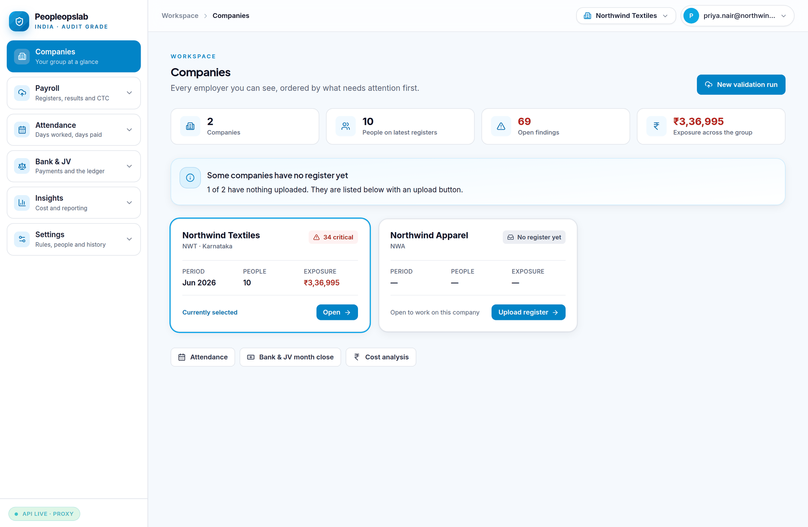

Each card shows the latest period, how many people were on it, open findings,
anything critical, and the total financial exposure. **Open** selects that
company and takes you into its work. A company with nothing uploaded says so.

The company you are currently working on is also shown top-right, and you can
switch there at any time.

### The sidebar

Six boxes. Click one to open it; only the box you are working in stays open.

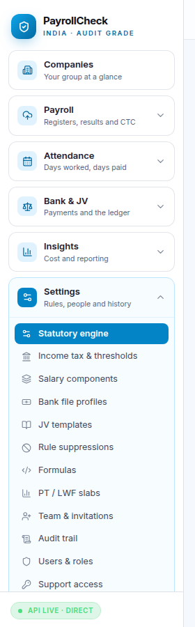

| Box | What is inside |
|---|---|
| **Companies** | The landing page |
| **Payroll** | Upload & validate, Results, Register history, CTC, Budget |
| **Attendance** | The attendance register |
| **Bank & JV** | Month close, Bank payments, Journal voucher |
| **Insights** | Cost analysis, Reports |
| **Settings** | Rules, people, history |

---

## 4. The monthly routine

Once payroll is run and before it is paid:

```
  1  Upload attendance        →  do the days add up?
  2  Upload the register      →  does the pay match the statute and the days?
  3  Work the findings        →  fix, or explain
  4  Reconcile the bank file  →  did the right money reach the right accounts?
  5  Post the journal voucher →  does the ledger agree?
  6  Sign the period off      →  closed, with a record of who closed it
```

You can do 1 and 2 in either order, but attendance first is better: it lets the
product tell you that someone lost three days the register never deducted.

---

## 5. Step by step

### Step 1 — Attendance

**Attendance → Attendance register.** Upload the month's attendance, then
**validate** before committing.

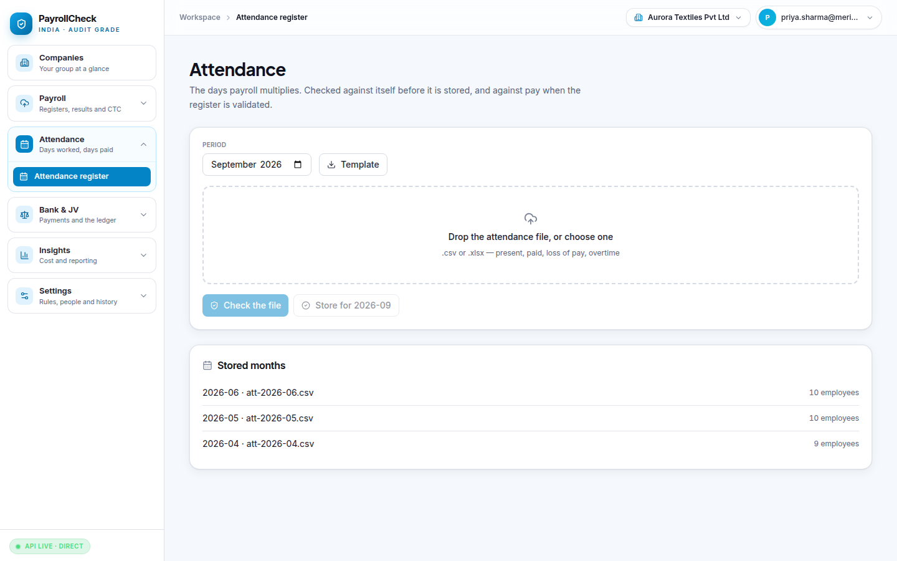

The file is checked against itself first: calendar days, present days, paid
leave, weekly offs, holidays, loss of pay and paid days all have to add up. **If
it contradicts itself, nothing is stored.** That is deliberate — a timesheet
that does not add up produces confident, wrong conclusions about the pay.

Fix the file and upload again. When it validates clean, commit it.

### Step 2 — Upload the register

**Payroll → Upload & validate.** Three steps, shown across the top.

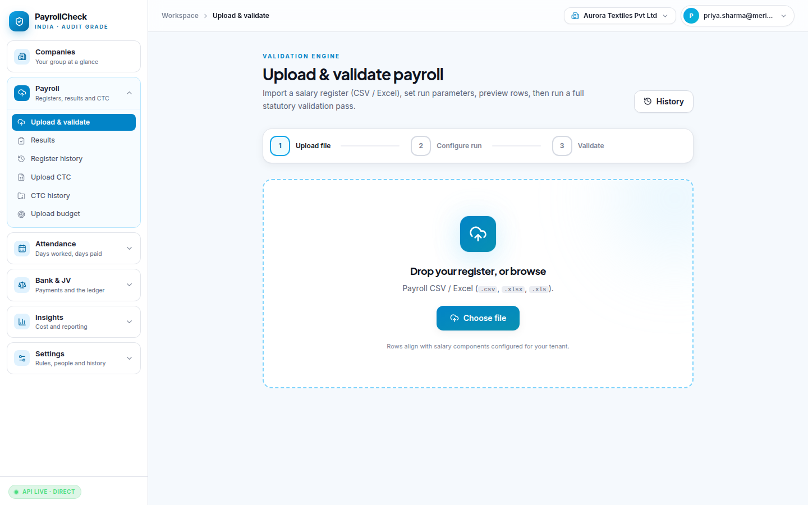

1. **Upload file** — CSV or Excel, straight out of your payroll system.
2. **Configure run** — the period, and the run type (regular, increment,
   arrears, full & final).
3. **Validate** — runs the full statutory pass.

### Step 3 — Read the results

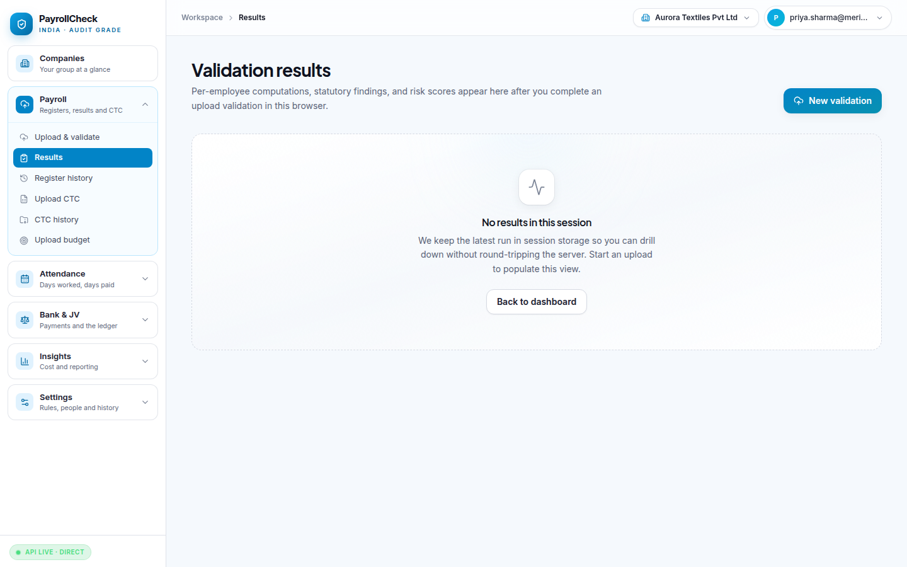

Each finding carries a rule ID, a severity, what was expected, what the register
actually said, the difference in rupees, and a suggested fix.

**Severities, and what they mean for you:**

| Severity | Meaning | Do |
|---|---|---|
| **CRITICAL** | A statutory breach or an unexplained money difference | Before paying |
| **HIGH** | Very likely wrong | This cycle |
| **MEDIUM** | Worth a look | This cycle if you can |
| **LOW / INFO** | Observation | When convenient |

**A finding is a question, not an accusation.** The product is telling you what
it computed and what your register said. Sometimes the register is right and the
configuration is wrong — say so, and it stops asking.

For each finding you can:

- **Fix it in payroll** and re-upload. The finding disappears when it stops
  being true.
- **Note it** — record why it is as it is, and leave it open.
- **Waive it** — with a reason. Waivers **expire by default**, so "accepted
  once" does not quietly become "invisible forever" across a change of staff or
  of law.

A finding in its first month is a mistake. The same finding in its ninth month
is a process problem — the product counts how many periods each one has survived
so you can tell those apart.

### Step 4 — Bank payments

**Bank & JV → Bank payments.** Upload the payment advice you send the bank, or
the statement you get back.

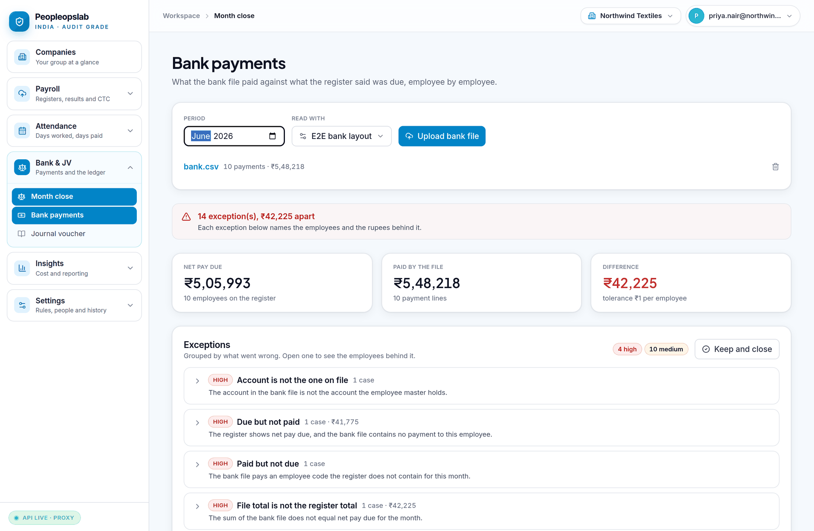

The first time, someone sets up a **profile** describing your bank's layout.
After that it is just a file upload.

What it finds, among others:

- Someone **due but not paid**.
- Someone **paid but not due** — a payee on no register.
- A **different amount** than the register said.
- The **same person paid twice**.
- **Two employees sharing one account**.
- An account that is **not the one on the employee master** — occasionally a
  genuine change the employee requested, and the single most important line in
  the report. Verify it through a channel that is not email alone.

### Step 5 — Journal voucher

**Bank & JV → Journal voucher.** Builds the accounting entry from the register
using your own account codes.

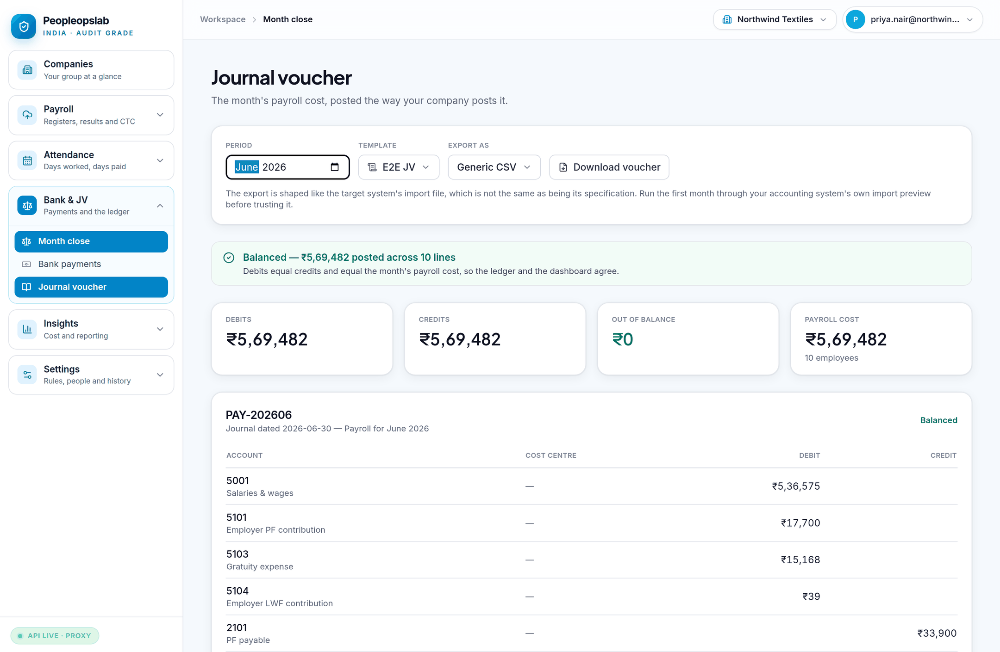

Preview it, confirm it **balances**, then export — generic CSV, Tally, SAP or
Zoho.

### Step 6 — Month close

**Bank & JV → Month close** shows all three together for the period: findings,
bank reconciliation, JV balance.

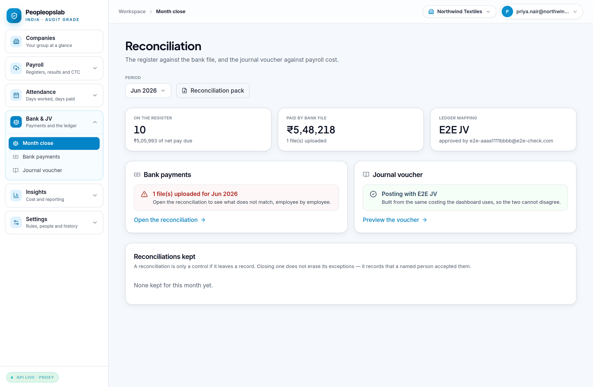

When everything is resolved or explained, **sign the period off**. That records
who closed it and when. A signed period can be reopened, and the reopening is
recorded too.

---

## 6. Cost analysis and reports

### Cost analysis

**Insights → Cost analysis.** What payroll cost, broken down by department, cost
centre, state, grade or any other dimension on the employee master, and how it
moved month to month.

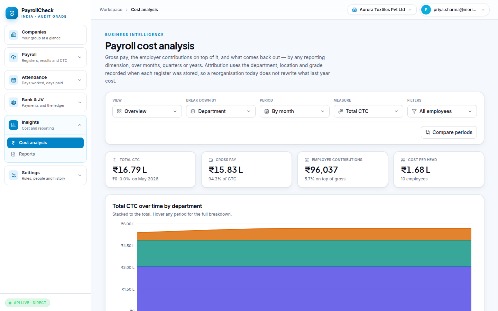

The cost taxonomy is explicit: **CTC = earnings + employer contributions**.
Deductions sit *inside* gross and are not an additional cost to the company —
counting them again is the most common way payroll cost gets overstated.

### Reports

**Insights → Reports.** Excel exports for filing, evidence and review.

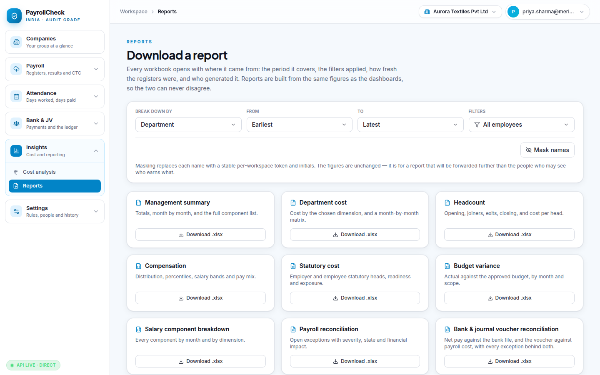

### Register history

**Payroll → Register history.** Every register uploaded, by period.

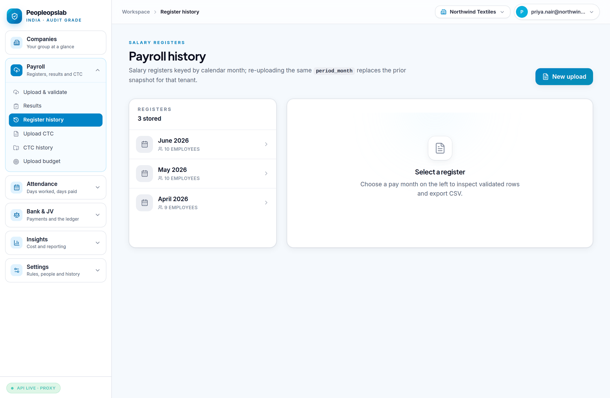

---

## 7. Questions people ask

**Will this change my payroll?**
No. It reads your register and reports. Nothing here writes back to your payroll
system or alters a payslip.

**There are hundreds of findings on my first run. Is that right?**
Yes, and it is expected. Most first-run findings come from configuration not yet
matching your structure. Work the CRITICALs first; the count usually collapses
once a component flag is corrected.

**A finding is wrong. The register is right.**
Then the configuration is wrong. Tell your administrator which rule and which
component. If the difference is deliberate, waive it with a reason so it stops
appearing.

**Can I see another company in the group?**
Only the ones you have been given access to. If a company you need is missing,
your administrator grants it.

**Someone from the software company can see our data?**
Only if you allow it, only for a stated reason, only for a time limit, only
read-only, with identities masked — and you will see a banner the whole time and
can revoke instantly. Your owner controls this under
**Settings → Team & invitations → Support access**, including switching it off
entirely.

**The first page of the day is slow.**
On smaller hosting plans the server sleeps when idle and takes up to a minute to
wake. After that it is quick. The page tells you when this is what is happening.

**Who changed this setting?**
**Settings → Audit trail.** Append-only, and it records who did what and when.

---

## 8. Getting help

Before raising a ticket, have ready: the **company**, the **period**, the **rule
ID**, and the **employee ID**. Those four make almost any question answerable
without anyone needing to look at your salary data.
