# Peopleopslab — User Manual

For the people who use Peopleopslab each month: payroll, HR and finance staff at
a client company.

You do not need to understand the rule engine to use this. You need to know
where to put the file, what the answers mean, and what to do about them.

---

## 1. What this does for you

You run payroll in whatever system you already use. Peopleopslab takes the
register that comes out of it and independently works out what the statute says
should have been there — PF, ESIC, professional tax, labour welfare fund, income
tax — then tells you every place the two disagree, what it costs, and what to do.

It also checks two things a register cannot check about itself:

- **Attendance** — whether people were paid for the days they actually worked.
- **Bank and ledger** — whether what the register says was due is what actually
  left the bank and what actually hit the accounts.

**It never pays anyone and never changes your payroll.** Nothing you do here
alters a payslip.

---

## 2. Signing in

Your administrator sends an invitation link. It works once, expires after seven
days, and only for the email address it was sent to. Open it and set your
password.

From then on, sign in at **your workspace's own address**, which your
administrator gives you with the invitation — for example
`https://www.peopleopslab.in/w/acme-industries/login`. Bookmark it. Your email
and password work only there; at any other address they are refused, with the
same message as a wrong password.

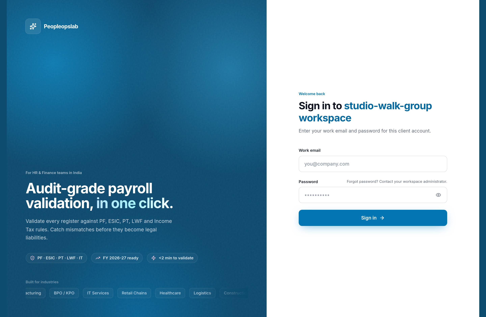

After signing in you land on **Companies**.

---

## 3. Finding your way around

### Companies — the landing page

Every company you have access to, each with its own state, ordered so the one
needing attention is first.

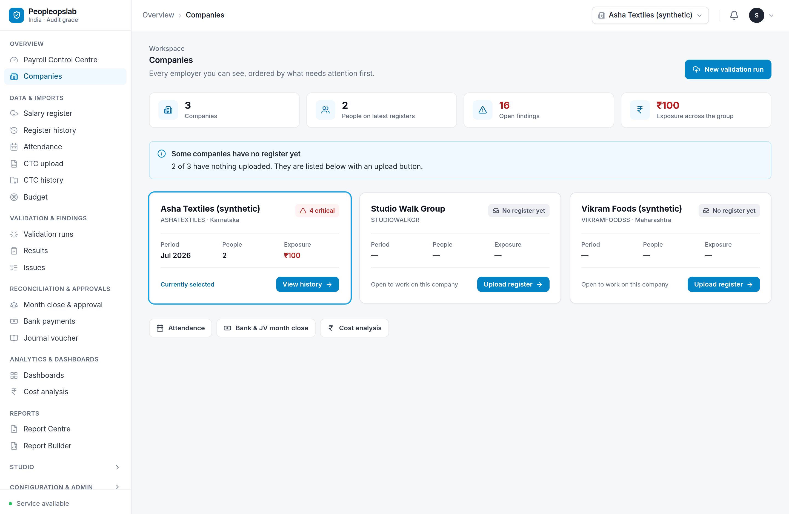

Each card shows the latest period, how many people were on it, open findings,
anything critical, and the total financial exposure. **Open** selects that
company and takes you into its work. A company with nothing uploaded says so.

The company you are currently working on is also shown top-right, and you can
switch there at any time.

### The sidebar

Six boxes. Click one to open it; only the box you are working in stays open.

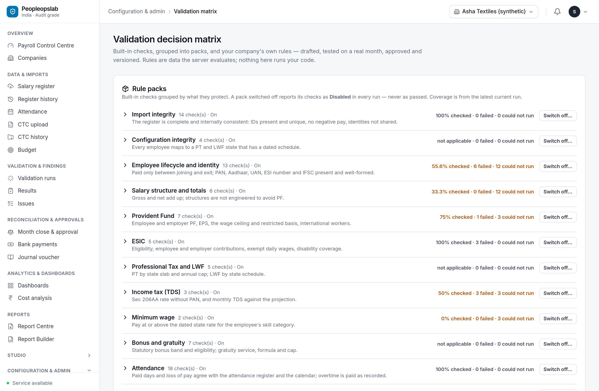

| Box | What is inside |
|---|---|
| **Companies** | The landing page |
| **Payroll** | Upload & validate, Results, Register history, CTC, Budget |
| **Attendance** | The attendance register |
| **Bank & JV** | Month close, Bank payments, Journal voucher |
| **Insights** | Cost analysis, Reports |
| **Studio** | Connections to your other systems: the API Centre, connections, data mapping, webhooks, and the run history of every batch they sent (analysts and above) |
| **Settings** | Rules, people, history |

---

## 4. The monthly routine

Once payroll is run and before it is paid:

```
  1  Upload attendance        →  do the days add up?
  2  Upload the register      →  does the pay match the statute and the days?
  3  Work the findings        →  fix, or explain (Payroll → Issues)
  4  Reconcile the bank file  →  did the right money reach the right accounts?
  5  Post the journal voucher →  does the ledger agree?
  6  Sign the period off      →  closed, with a record of who closed it
```

You can do 1 and 2 in either order, but attendance first is better: it lets the
product tell you that someone lost three days the register never deducted.

---

## 5. Step by step

### Step 1 — Attendance

**Attendance → Attendance register.** Upload the month's attendance, then
**validate** before committing.

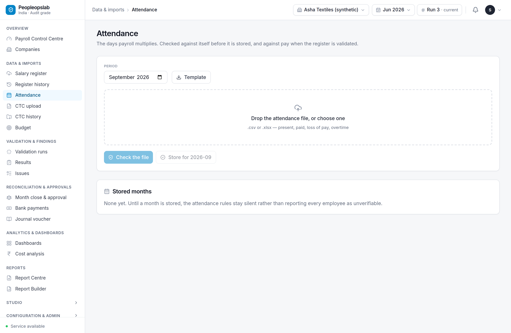

The file is checked against itself first: calendar days, present days, paid
leave, weekly offs, holidays, loss of pay and paid days all have to add up. **If
it contradicts itself, nothing is stored.** That is deliberate — a timesheet
that does not add up produces confident, wrong conclusions about the pay.

Fix the file and upload again. When it validates clean, commit it.

### Step 2 — Upload the register

**Payroll → Upload & validate.** Three steps, shown across the top.

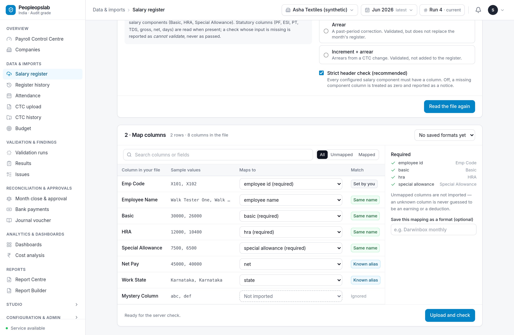

1. **Upload file** — CSV or Excel, straight out of your payroll system.
2. **Configure run** — the payroll month, and the run type (regular, increment,
   arrears, full & final). Map the file's columns once and save the mapping as
   a format for next month.
3. **Validate** — queues the full statutory pass.

**Validation runs on the server, not in your browser.** After you press
**Run validation** you are taken to a progress page showing the stage (reading
the register, checking employees, saving results) and how many employees have
been checked. **You can close the page** — the validation keeps going, the
upload page shows a link back to it, and **Payroll → Validations** lists every
validation with its outcome. A large register (thousands of employees) takes a
few minutes.

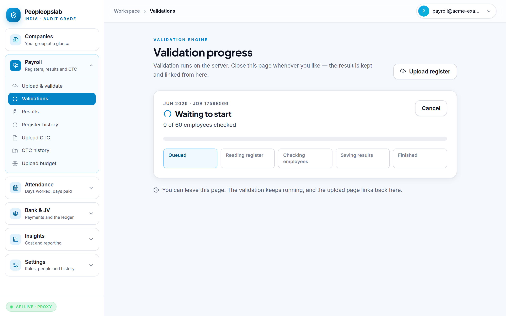

- **Cancel** stops it; nothing from a cancelled attempt is kept.
- If it **fails**, the page says why and what to fix. **Retry** is always safe:
  a failed attempt saves nothing, so retrying cannot produce duplicates.
- Pressing Validate twice, or in two tabs, does not start two validations — the
  second joins the first.

**Every upload is kept.** Re-uploading a corrected file does not erase the first
one: each upload records the file's fingerprint (SHA-256) and a revision number,
so months later you can show exactly which file was checked.

### Step 3 — Read the results

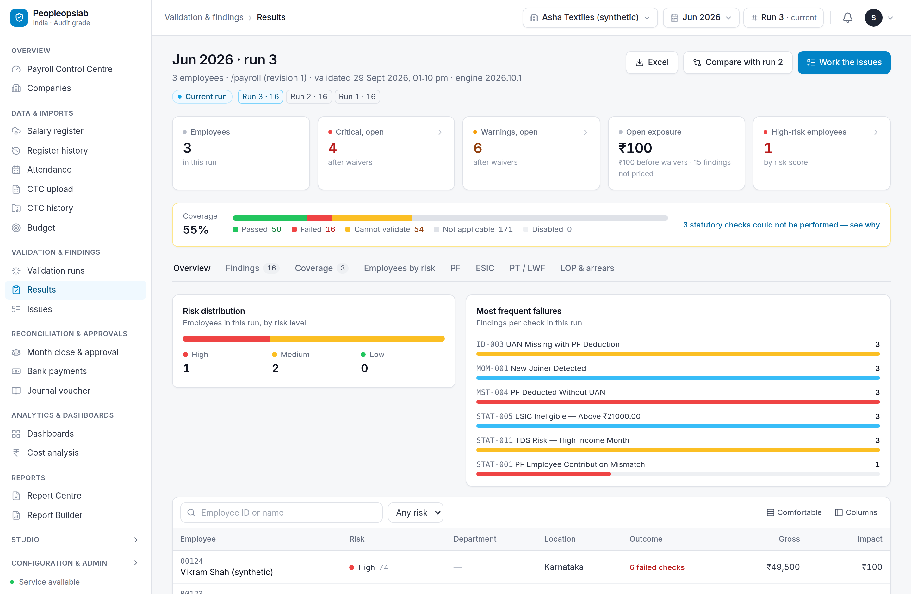

Results are a **run**: a numbered, dated record of one validation of one month.
Validating the month again creates the next run; the earlier one is kept,
marked *superseded*, and still shows exactly what it reported. The chips at the
top of the results page switch between a month's runs, and **Compare** shows
what changed between two of them — which findings are **new**, which were
**resolved**, which **changed** and which are **unchanged**, with the rupee
totals of each.

If anything the result depended on changes after the run — the register is
re-uploaded, the employee master or attendance changes, or a component flag,
rate or rule is edited — the page shows **"Revalidation required"**, names
what changed, and offers to revalidate. A month is never shown as current when
its inputs have moved.

Large results are paged: search and filter by employee, risk level, severity or
rule, and download the whole run to Excel — exactly as it was recorded, not
re-computed.

Each finding carries a rule ID, a severity, what was expected, what the register
actually said, the difference in rupees, and a suggested fix. Where the product
does not put a rupee figure on a finding — a missing PAN, a duplicate UAN — it
says **"Impact not calculated"**. That is not ₹0; it means the cost was not
worked out, and such findings are left out of the exposure total rather than
added in as nothing. When two checks report the same rupees (PF short under two
rules, say), the total counts them once.

**Coverage — what was checked, not just what failed.** Every check reaches one
of five outcomes for every employee:

| Outcome | Means |
|---|---|
| **Passed** | The check ran and the register agreed |
| **Failed** | The check ran and found a problem — a finding |
| **Cannot validate** | The check needed something you did not supply — a column, the employee master, a minimum-wage decision |
| **Not applicable** | The check does not apply to this person — ESIC above the wage ceiling, say |
| **Disabled** | Your administrator switched the check off |

The strip under the figures shows the counts and a **coverage** percentage: of
the checks that applied, how many reached a verdict. A month with no failures
and 60% coverage has not been shown to be clean — 40% of it was not checked.
The **Coverage** tab lists the inputs that were missing, how many checks each
would have unlocked, and the employees who could not be fully checked. The
employee view lists every check for that person with its outcome and the reason.

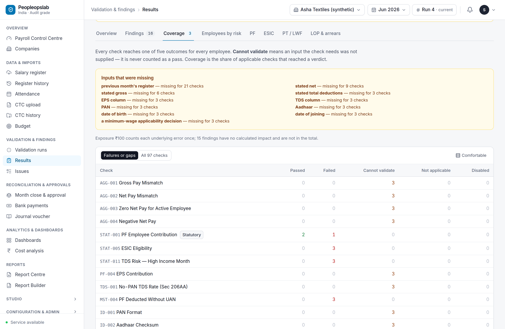

**Why this result?** Every finding has a **Why this result?** link. It opens
the finding with everything behind it: the file, sheet, row and column the value
came from; the calculation, restated from what the run recorded; the tolerance;
the rule and the version of it in force; who has reviewed it since; and whether
the month has been approved. Statutory figures there are your company's
configuration at the time of the run — not a statement of the law.

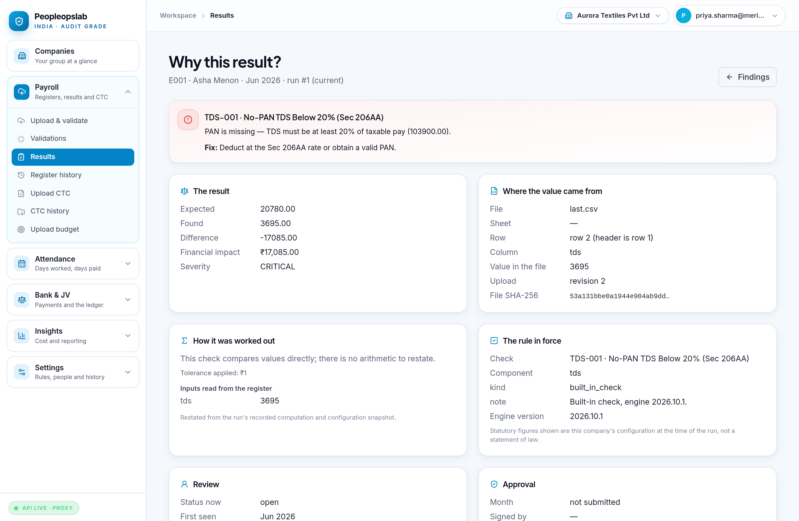

**Severities, and what they mean for you:**

| Severity | Meaning | Do |
|---|---|---|
| **CRITICAL** | A statutory breach or an unexplained money difference | Before paying |
| **HIGH** | Very likely wrong | This cycle |
| **MEDIUM** | Worth a look | This cycle if you can |
| **LOW / INFO** | Observation | When convenient |

**A finding is a question, not an accusation.** The product is telling you what
it computed and what your register said. Sometimes the register is right and the
configuration is wrong — say so, and it stops asking.

### Working the issues

**Payroll → Issues** is where findings get worked. It lists every finding
still open across months — not just this upload — worst first: critical before
warning, the ones that keep coming back before the new ones, the expensive
before the cheap. Filter by state, severity, rule, owner, overdue or recurring,
or search by employee.

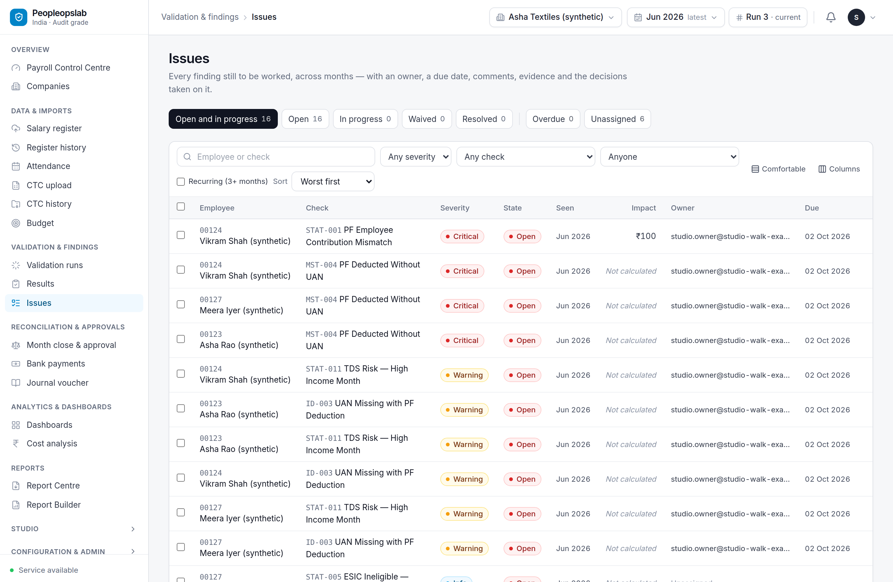

Open a finding to:

- **Give it an owner and a due date.** Overdue findings are counted at the top
  of the page, and **Assigned to me** filters to your own.
- **Comment** — what you asked, who answered. Comments cannot be edited or
  deleted; they are the record.
- **Attach evidence** — the vendor's letter, the revised offer, the signed
  approval. PDF, PNG, JPEG, XLSX, XLS, CSV or text, up to 5 MB each. A file
  whose contents do not match its extension is refused.
- **Decide:**
  - **Mark in progress** — someone is on it.
  - **Resolve** — with a reason: what was corrected, or why it was never an
    error. If the next run finds it again, it reopens by itself.
  - **Waive** — with a reason, and **always with an end date**: 90 days if
    you give none, at most 366. When the date passes, the finding reopens and
    the history says the waiver expired. A waiver given before waivers had to
    end shows **"no end date — review"**; waive it again with a date, or reopen it.

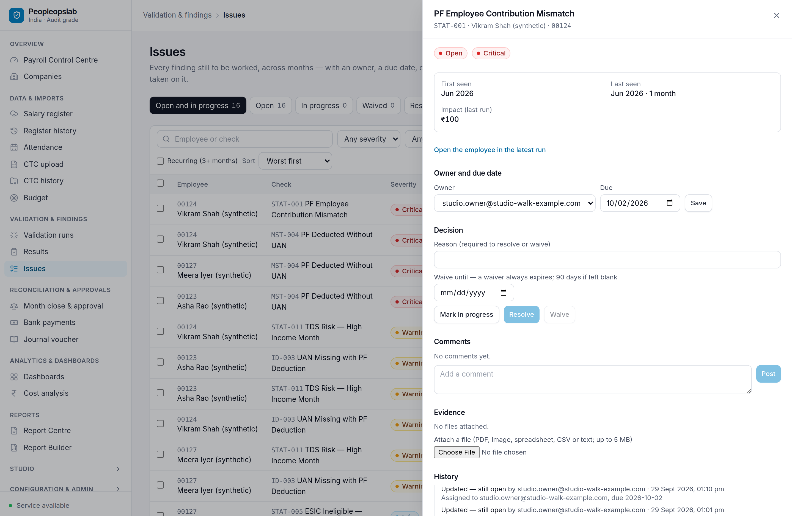

**Many findings at once.** Tick them (or tick the header to select the page)
and choose **Resolve…**, **Waive…**, **Assign…** or **Mark in progress**. Each
finding gets its own entry in its history with the shared reason, exactly as
if you had done them one by one.

A finding in its first month is a mistake. The same finding in its ninth month
is a process problem — the product counts how many months each one has
survived, and **Recurring (3+ months)** shows you those.

Anyone can read the issues; changing them needs an analyst, manager or owner
role, and only people who can work this company can be given one.

### Step 4 — Bank payments

**Bank & JV → Bank payments.** Upload the payment advice you send the bank, or
the statement you get back.

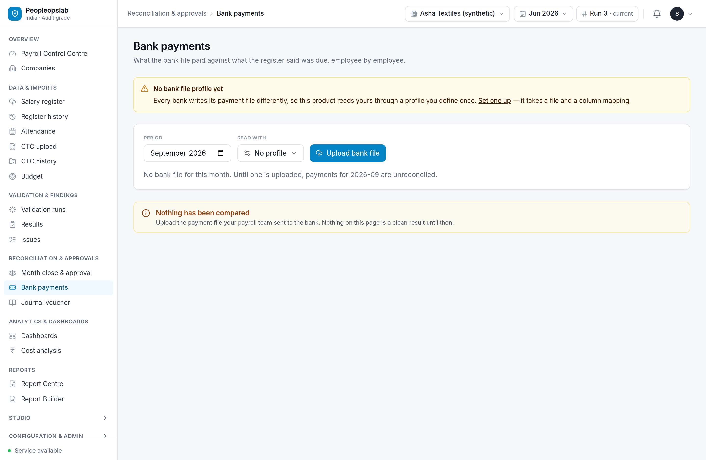

The first time, someone sets up a **profile** describing your bank's layout.
After that it is just a file upload.

What it finds, among others:

- Someone **due but not paid**.
- Someone **paid but not due** — a payee on no register.
- A **different amount** than the register said.
- The **same person paid twice**.
- **Two employees sharing one account**.
- An account that is **not the one on the employee master** — occasionally a
  genuine change the employee requested, and the single most important line in
  the report. Verify it through a channel that is not email alone.

### Step 5 — Journal voucher

**Bank & JV → Journal voucher.** Builds the accounting entry from the register
using your own account codes.

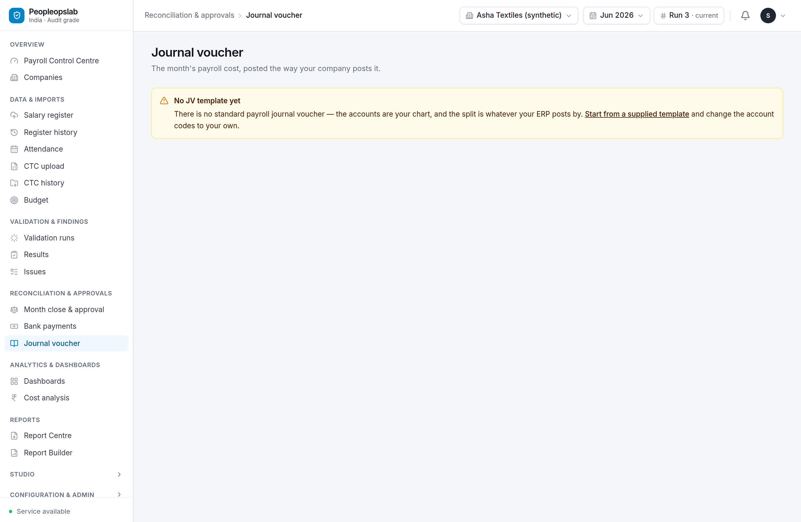

Preview it, confirm it **balances**, then export — generic CSV, Tally, SAP or
Zoho.

### Step 6 — Month close

**Bank & JV → Month close** shows the period together: bank reconciliation, JV,
and the month's **approval**.

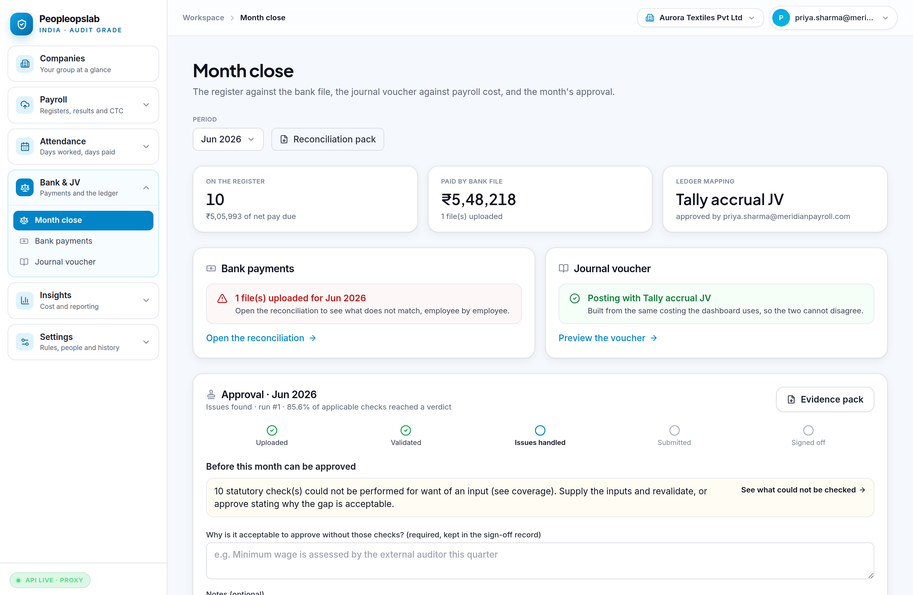

The approval panel shows where the month stands — *Uploaded → Validated →
Issues handled → Submitted → Signed off* — and, in plain words, anything that
stands in the way of the next step:

- **Not validated** — nothing to approve yet. Upload and validate.
- **Revalidation required** — something the run read has changed since. It
  names what; revalidate first.
- **Statutory checks could not be performed** — the month can still be
  approved, but only by stating why the gap is acceptable. That reason is kept
  in the sign-off record.

A month with no findings is **not** automatically ready: if material checks
could not run, it says so.

1. Someone with a write role **submits** the month, with optional notes.
2. An owner or manager **approves** it. If your organisation requires an
   independent approver, the person who submitted cannot approve — the panel
   says so and asks for someone else. Either way, the record states whether
   the approval was independent.
3. A signed month can be **reopened** by an owner or manager, with a reason.
   The signed record is kept, and the reopening is in the history. If anything
   changes after a month is signed, the panel says what — the signature stands
   as recorded, but no longer describes the month as it is.

**Evidence pack** downloads the workbook an auditor wants: the run and its
input fingerprints, coverage by check, every finding with its file row, the
approval trail, and the rates and schedules in force.

---

## 6. Cost analysis and reports

### Cost analysis

**Insights → Cost analysis.** What payroll cost, broken down by department, cost
centre, state, grade or any other dimension on the employee master, and how it
moved month to month.

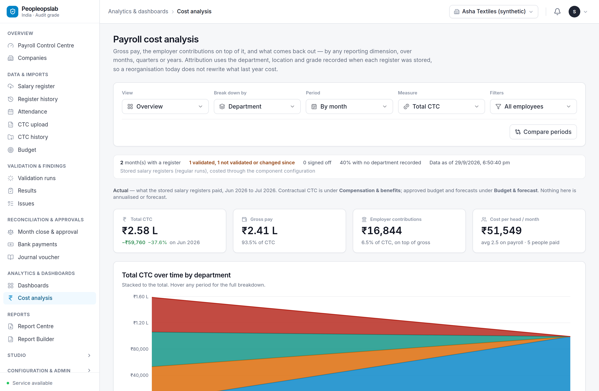

The cost taxonomy is explicit: **CTC = earnings + employer contributions**.
Deductions sit *inside* gross and are not an additional cost to the company —
counting them again is the most common way payroll cost gets overstated.

**How the headline figures are defined** (hover the ⓘ on any figure for the same text):

| Figure | Meaning |
|---|---|
| **People paid** | Distinct employees on a regular register in the period — payroll headcount, not joining dates |
| **Average monthly headcount** | Employees on each month's register, averaged over the months that have one |
| **Cost per head / month** | Total CTC ÷ person-months. The same monthly definition for a month, a quarter or a year |

The strip above the figures says what they rest on: how many months have a
register, **which months are missing** (they are left out, not counted as ₹0),
how many months were validated or have changed since, how many are signed off,
how many people have no department recorded, and when data last arrived. An
arrears or off-cycle file is validated but never replaces the month's register,
so a month's cost is never overwritten by its arrears. In **Budget vs actual**, a
budgeted month with no register reads **no register** — not a ₹0 actual and a
false underspend — and is left out of the totals.

### Dashboards

**Insights → Dashboards.** Boards of your own and boards shared with the
company. **Start from a template** — payroll cost, headcount and movement,
statutory contributions, validation quality, issue resolution, budget vs actual,
department cost, month-close readiness — to get a private copy you can use as it
is or change.

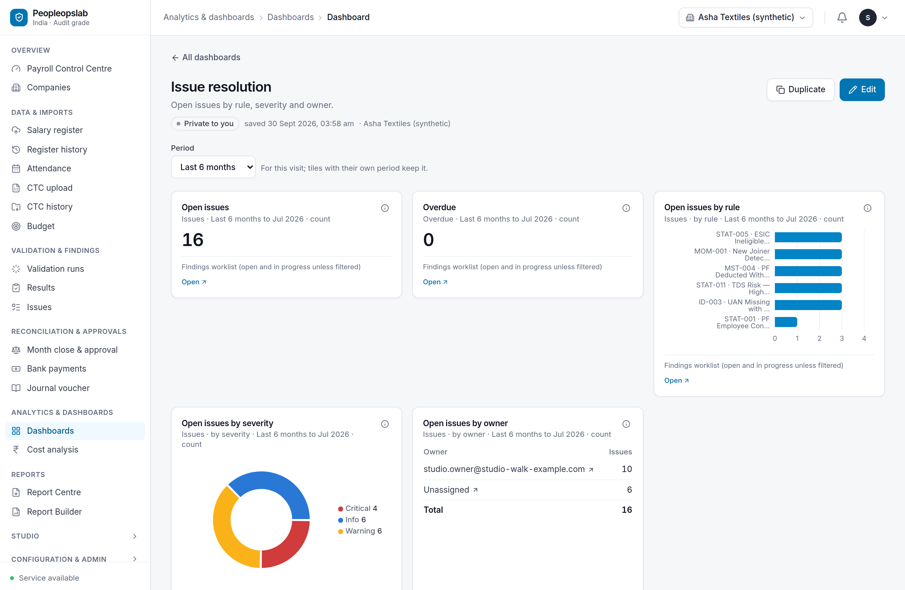

Each tile is a question answered when you open the board, from this company's
data only: pick the **dataset**, the **metric** (or a custom KPI), the
**breakdown**, the **chart**, any **filters**, and the tile takes the board's
**period** unless you set its own. A tile shows what it rests on under the
figure — months missing, months not validated — and **Open** (or clicking a bar
or a row) goes to the page behind it, already filtered.

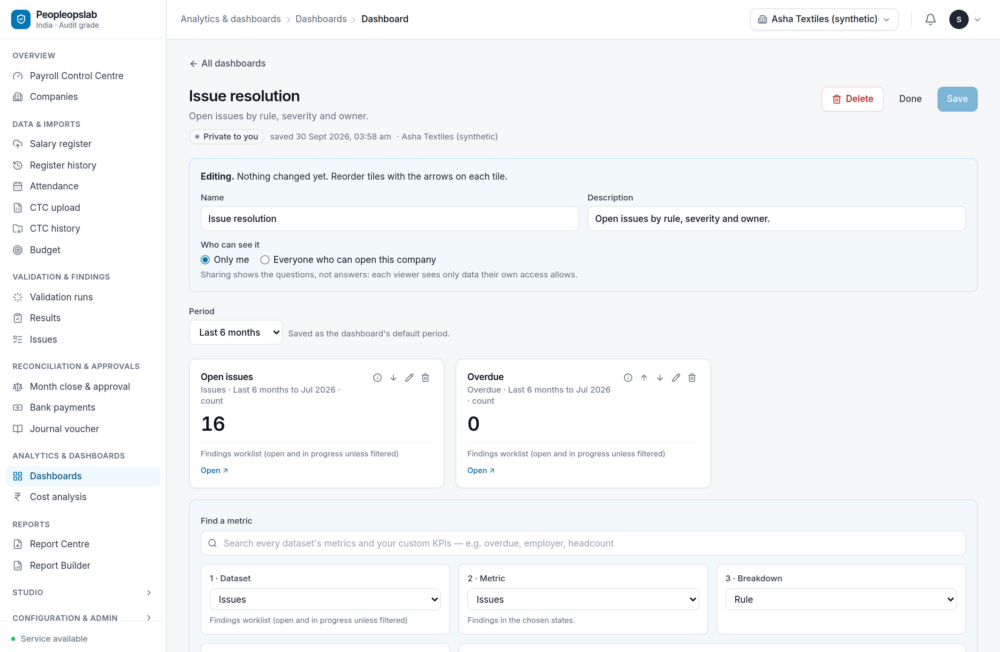

**Custom KPIs** are formulas over one dataset's metrics, such as
`employer_cost / gross * 100`. They are computed safely on the server; a KPI
whose input is missing, or that would divide by zero, shows "—", never 0.

**Who sees what.** A private board or KPI is yours alone. Sharing one shows it
to everyone who can open this company; that needs an analyst, manager or owner
role. The owner edits a board; an owner or manager can also edit or delete a
shared one. A shared board cannot use a private KPI. Other companies in the
group never see this company's boards.

### Reports

**Insights → Reports.** Select the company first, then a reporting period,
dimension and optional filters. The catalogue groups available reports by
purpose and lists required input data. Choose **Mask names** when the workbook
will be shared with someone who need not see employee identities. Download the
Excel workbook and check its **About this report** and **Data basis** sheets
before using its figures. An absent payroll month is not treated as a zero
month. Finding reconciliation shows current finding state within the selected
last-seen period; it does not reconstruct an earlier run.

The workbook is generated from current stored data. Keep the downloaded file
as evidence; generating the same report later may produce different values if
source registers or configurations have changed. The current catalogue does
not create an official statutory filing format.

**Build a report:** Open **Insights → Reports → Build a report**. Choose the
payroll cost dataset, columns, period and filters, optional arithmetic calculation,
breakdown and sort. Preview the result and its CTC control total before saving a
personal draft. A manager can share a definition with the company. A saved
definition is evaluated against current data when opened again. Preview shows
at most 200 rows and states the full matched count. Save the definition with both
period bounds, then use **Generate Excel**. The job appears in **Generated history** with its\nstatus; download the completed file and check
the summary and data-basis sheets before sharing. A generated file is fixed,\nexpires after the configured retention period, and remains subject to your\ncurrent company access.

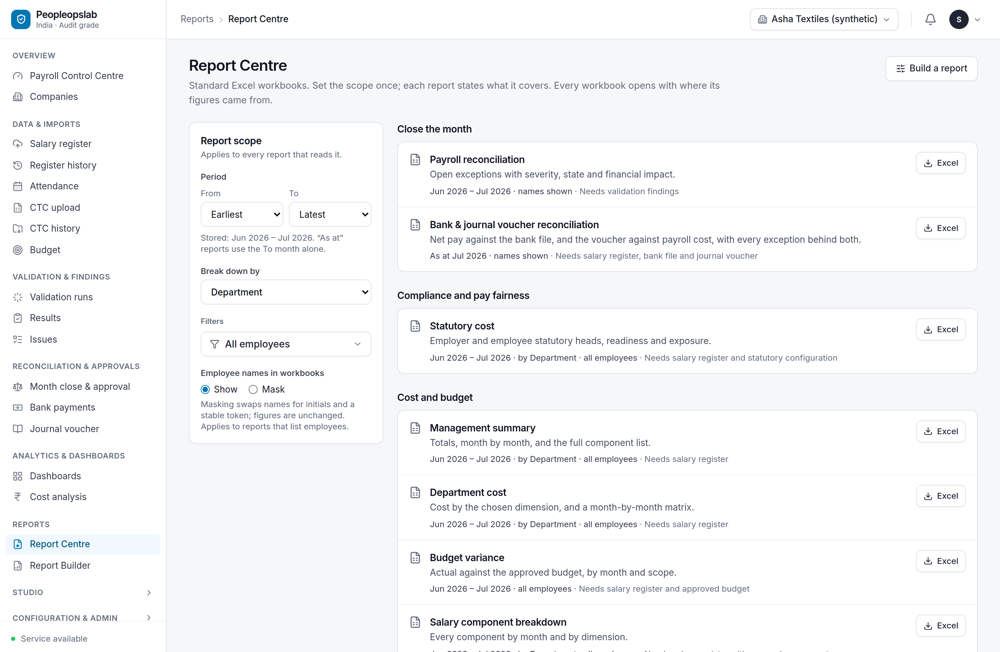

### Register history

**Payroll → Register history.** Every register uploaded, by period.

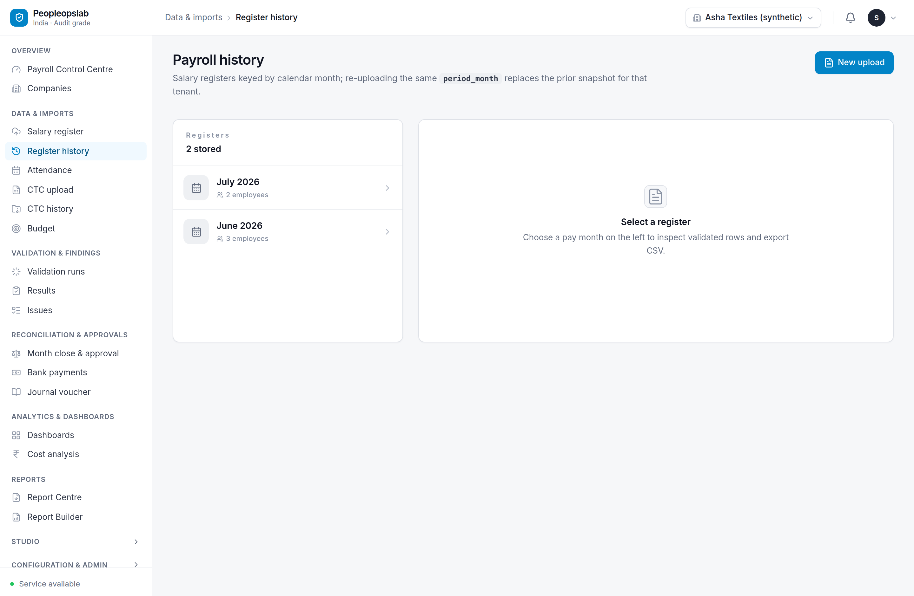

---

## 6b. Data sent by your other systems (Studio)

If your HRMS, attendance or payroll system sends data to PeopleOpsLab directly,
each batch appears in **Studio → Run history**.

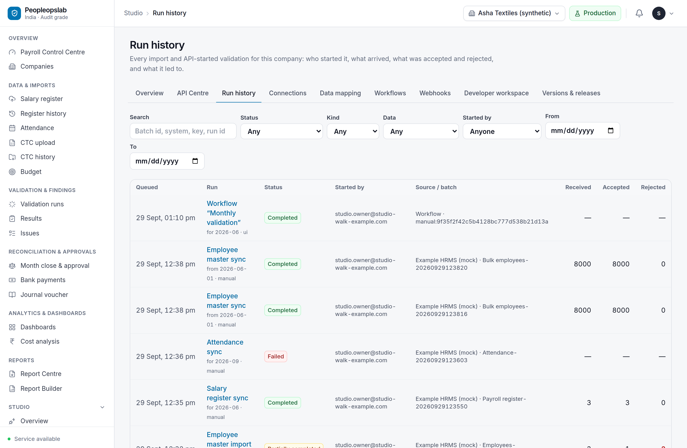

Open a run to see what happened to every record:

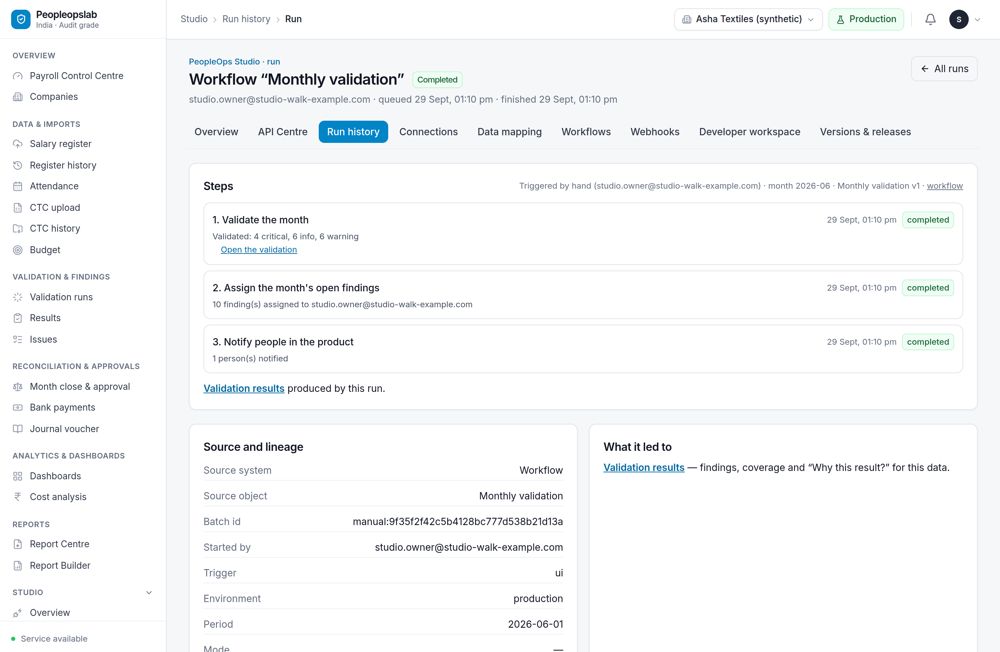

- **Received → accepted / rejected / skipped → created / updated / unchanged.**
  The two lines under the counts must both be green: every record received is
  accounted for, and every record accepted was stored.
- **Rejected** records were not stored. Each says which row, which field and
  why — a date that could not be read, a number that was not a number, the same
  employee twice with different values. Fix them in the sending system and send
  just those again. Nothing is ever stored as blank or zero because it could
  not be read.
- **Skipped** records were exact repeats of another row and were kept once.
- **What it led to** links to the validation results, when the batch was a
  register sent for validation.

A run started by a connection your administrator set up (**Studio →
Connections**) reads the same way, and also names the connection, the stream
and the **mapping version** that turned the other system's fields into ours.
If the same kind of rejection appears on every record, the mapping is the
likely cause — tell whoever looks after it; they can preview a fix against
the rejected rows before publishing it.

A service account can acknowledge and comment on findings, but only a person
can waive or resolve one, publish a rule, or approve a month.

**Notifications.** If your administrator has set up workflows, the bell at the
top of every page shows what they tell you — "June validated", "3 records
rejected" — with a link to the page concerned. They are yours alone. Workflows
can assign findings to you with a due date; they never waive, resolve or
approve anything.

**On Month close,** *Data from your systems* shows, for the month, how each
input arrived and whether anything was rejected or failed. Rejected records
are not in the month until they are fixed and sent again — check this before
approving.

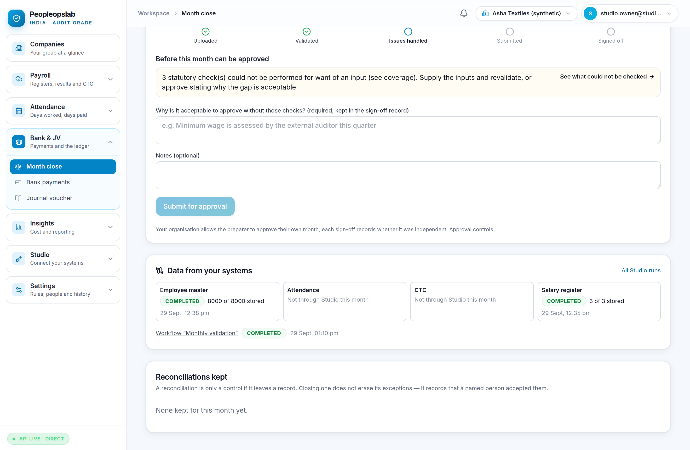

---

## 7. Questions people ask

**Will this change my payroll?**
No. It reads your register and reports. Nothing here writes back to your payroll
system or alters a payslip.

**There are hundreds of findings on my first run. Is that right?**
Yes, and it is expected. Most first-run findings come from configuration not yet
matching your structure. Work the CRITICALs first; the count usually collapses
once a component flag is corrected.

**A finding is wrong. The register is right.**
Then the configuration is wrong. Tell your administrator which rule and which
component. If the difference is deliberate, waive it with a reason so it stops
appearing.

**Can I see another company in the group?**
Only the ones you have been given access to. If a company you need is missing,
your administrator grants it.

**Someone from the software company can see our data?**
Only if you allow it, only for a stated reason, only for a time limit, only
read-only, with identities masked — and you will see a banner the whole time and
can revoke instantly. Your owner controls this under
**Settings → Team & invitations → Support access**, including switching it off
entirely.

**I closed the browser during validation. Is it lost?**
No. It kept running on the server. Open **Payroll → Validations**, or the upload
page, which links to any validation still in progress.

**We re-uploaded the register. Where did the first results go?**
Nowhere. Each validation is kept as a run. Open the results and pick the earlier
run from the chips at the top, or use **Compare**.

**The first page of the day is slow.**
On smaller hosting plans the server sleeps when idle and takes up to a minute to
wake. After that it is quick. The page tells you when this is what is happening.

**Nothing failed. Why can we not approve?**
Because some statutory checks could not run — most often, no decision on
whether minimum wage applies, or no employee master. The approval panel links
to exactly what is missing. Supply it and revalidate, or approve stating why
the gap is acceptable.

**Can a waiver last forever?**
No. Every waiver has an end date — 90 days by default, a year at most. When it
lapses the finding reopens, and the history says why.

**Why does a finding say "Impact not calculated"?**
Because the product did not work out a rupee figure for it — not because it
costs nothing. Open **Why this result?** to see what was compared.

**Who changed this setting?**
**Settings → Audit trail.** Append-only, and it records who did what and when.

---

## 8. Getting help

Before raising a ticket, have ready: the **company**, the **period**, the **rule
ID**, and the **employee ID**. Those four make almost any question answerable
without anyone needing to look at your salary data.
