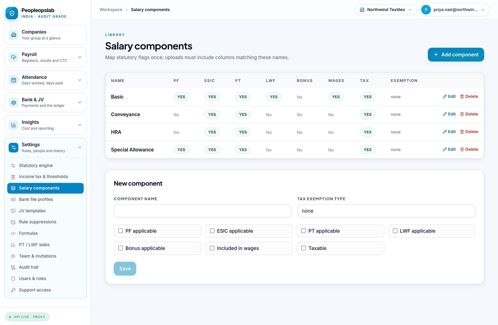
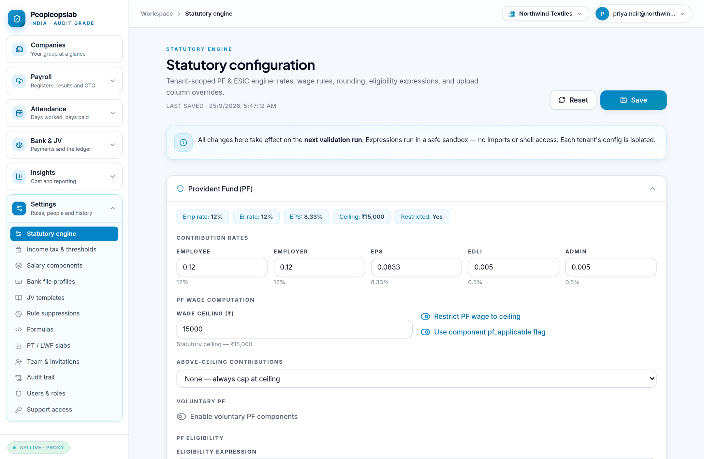

# Peopleopslab — Implementation Manual

How to take a client from "signed up" to "validating payroll in production", in
the order the steps actually have to happen.

This is the manual for whoever runs the implementation. It assumes nothing has
been configured. If you are looking for how to *operate* the product once it is
running, see the [Admin Manual](ADMIN_MANUAL.md) and the
[Client User Manual](CLIENT_USER_MANUAL.md).

---

## 0. What this product is, and what it is not

Peopleopslab **checks** payroll. It does not run it.

It never calculates the salary that gets paid, never holds the payment
instruction, never files a return. It takes the register your payroll system
produced and independently recomputes what the statute says should have been
there — then reports every difference, prices it, and tracks it until someone
decides what to do.

That separation is the product. A system that both computes payroll and audits
it is marking its own homework, and the errors it makes are exactly the errors
it cannot see.

**Implication for implementation:** you are not migrating payroll. You are
setting up an independent opinion. The client's payroll system keeps running
unchanged throughout, including during the parallel run.

---

## 1. Before you start — what you need from the client

Collect all of this before touching the product. Every item missing here becomes
a blocked step later.

| # | What | Why it is needed | Blocks |
|---|---|---|---|
| 1 | Legal entity list — name, state, PF code, ESIC code, TAN, PAN | Each employer is a separate scope | Everything |
| 2 | Salary structure — every component, and its statutory treatment | Decides PF wages, ESIC wages, PT and tax bases | Validation |
| 3 | Three months of salary registers (CSV/Excel) | Two to configure against, one to test against | Parallel run |
| 4 | Employee master — ID, name, gender, DOJ, DOE, state, department, cost centre, bank account, IFSC | Dimensions and the bank-account fraud check | Attendance, reconciliation |
| 5 | Attendance register for the same months | Days worked vs days paid | Attendance rules |
| 6 | One bank payment advice or statement | The layout the bank file profile is built from | Bank reconciliation |
| 7 | Chart of accounts extract — the codes payroll posts to | JV template account mapping | Journal voucher |
| 8 | Named owner at the client | Sign-off authority, and who receives invitations | Go-live |
| 9 | **A payroll expert who will verify the statutory rates** | See §8 | Production use |

> **Item 3 matters more than it looks.** One month of data cannot distinguish a
> structural configuration error from a one-off mistake in that month. Two clean
> months plus one test month is the minimum that tells you which you are looking
> at.

---

## 2. The order of configuration

Configuration has real dependencies. Doing it in a different order produces
validation runs that look catastrophically wrong for reasons that have nothing
to do with the payroll.

```
  1  Organization + entities        ← the scope everything else hangs off
          ↓
  2  Salary components              ← defines PF/ESIC/PT/tax wage bases
          ↓
  3  Statutory engine               ← rates, ceilings, rounding
          ↓
  4  PT / LWF slabs                 ← per state, per gender
          ↓
  5  Employee master                ← dimensions + bank accounts
          ↓
  6  Attendance register            ← must be self-consistent before pay checks
          ↓
  7  Salary register                ← the thing being validated
          ↓
  8  Bank file profile ─┐
  9  JV template       ─┴─ reconciliation, once a register exists
```

**Why this order.** Components define what counts as PF wages; the statutory
engine cannot be checked until it knows what it is applying rates to. Slabs are
per state, and the state comes off the employee master. Attendance must pass its
own self-consistency checks before it can be used to judge whether pay was
right — otherwise you are comparing a register against a broken timesheet.

---

## 3. Step by step

### Step 1 — Create the account and the entities

The first person to sign up on a fresh installation becomes the **platform
administrator**. On a shared installation that person is you, not the client.
See the [Admin Manual](ADMIN_MANUAL.md#1-the-first-account) before anyone signs
up.

Signing up creates an organization with one entity. Add the rest under
**Settings → Team & invitations** (organization) and the entity controls.

Set `org_type`:

- **`enterprise`** — one company, possibly a few legal entities. The default.
- **`practice`** — a payroll bureau or CA firm, one entity per client company.

It changes defaults and wording only. It never changes who can see what — that
is decided by membership and entity access, and nothing else.


*The landing page. Each company carries its own period, headcount, open and
critical findings and exposure, ordered by what needs attention first. A company
with nothing uploaded says so rather than showing zeros.*

### Step 2 — Salary components

**Settings → Salary components.** One row per component in the client's
structure, each flagged for its statutory treatment:

| Flag | Meaning | Get this wrong and… |
|---|---|---|
| `pf_applicable` | Counts toward PF wages | Every employee's PF is flagged |
| `esic_applicable` | Counts toward ESIC wages | ESIC eligibility is wrong at the ceiling |
| `pt_applicable` | Counts toward the PT slab test | Wrong slab, wrong deduction |
| `lwf_applicable` | Counts toward LWF | Minor, but wrong |
| `included_in_wages` | Part of gross | Cost taxonomy and JV both break |
| `taxable` | Enters the TDS base | Tax checks misfire |



> **The most common implementation error in the whole product** is marking
> Special Allowance as not PF-applicable because the client's payroll system
> does not deduct PF on it. The product is checking whether that is *correct*,
> not mirroring it. Configure what the statute says; let the validation report
> the difference.

### Step 3 — Statutory engine

**Settings → Statutory engine.** Rates, ceilings, rounding and eligibility.



Shipped defaults: PF 12% employee and employer, EPS 8.33%, ceiling ₹15,000,
EDLI and admin 0.5% each, ESIC 0.75% employee / 3.25% employer. Restrict-to-
ceiling is on by default.

Everything here takes effect on the **next** validation run — never
retroactively. A run already recorded stays exactly as it was reported.

### Step 4 — PT and LWF slabs

**Settings → PT / LWF slabs.** Import the shipped defaults for every state the
client employs in, then check each one against the state's current
notification. Professional tax is state law and changes on its own schedule;
Maharashtra has gender-specific slabs.

### Step 5 — Employee master

**Payroll → (workforce master).** ID, name, gender, date of joining, date of
exit, work state, department, cost centre, designation, employment type, bank
account and IFSC.

These are snapshotted onto each register row at upload. If the master is thin,
every breakdown in the product collapses into "Unassigned" — and the bank
reconciliation loses the account-change check, which is the single most useful
thing it finds.

### Step 6 — Attendance

**Attendance → Attendance register.** Validate before committing. The file must
be internally consistent — calendar days, present, paid leave, weekly off,
holiday, LOP and paid days have to add up — before it can be used to judge pay.


A file that contradicts itself is refused and nothing is stored. That is
deliberate: a bad timesheet accepted silently produces confident, wrong findings
against the register.

### Step 7 — First validation run

**Payroll → Upload & validate.** Three steps: upload the file, configure the run
(period, run type), then validate.


Results list every finding per employee, with rule ID, severity, expected vs
actual, financial impact and a suggested fix.


> **Expect a large number of findings on the first run.** This is normal and it
> is the point. Work them in severity order. Most first-run CRITICALs trace back
> to a component flag (Step 2), not to the payroll.

### Step 8 — Bank file profile

**Settings → Bank file profiles.** Every bank and every client formats payment
files differently, so the layout is configuration, not code: delimited or fixed
width, delimiter, header rows, rows to skip, trailer rows, amount unit and sign,
employee-ID transforms, row filters, and a column map.

Five presets are shipped as starting points. Test a profile against a real file
before saving — testing stores nothing.


### Step 9 — JV template

**Settings → JV templates.** How payroll posts to the ledger, which no two
companies do the same way: posting basis, split mode, grouping, detail level,
sign convention, net pay source, voucher date rule, narration template, export
format and balance tolerance.

Start from a preset (`standard_accrual` gives 14 rules), map the account codes
to the client's chart, then **approve** it. Editing an approved template
withdraws its approval — the mapping that posts to the ledger gets re-approved
when it changes.


Exports: generic CSV, Tally, SAP and Zoho.

### Step 10 — Month close

**Bank & JV → Month close** brings the three together for a period: validation
findings, bank reconciliation, JV balance.


---

## 4. The parallel run

Do not go live on a single month.

1. Pick **two closed months** the client has already paid and filed.
2. Configure against month one. Resolve every finding to one of:
   - a genuine payroll error the client confirms,
   - a configuration error in Peopleopslab, which you fix, or
   - a documented, deliberate difference, which you suppress with a reason.
3. Run month two **without changing configuration**. If new structural findings
   appear, month one was tuned rather than configured.
4. Run the current month alongside the client's own close.

**Exit criterion:** every remaining finding is one the client agrees is real.
Not zero findings — zero *unexplained* findings.

---

## 5. Deployment

For the environment itself — hosting, database, domain, TLS — see
[`DEPLOYMENT.md`](../DEPLOYMENT.md). For the release process, test layers and
rollback, see [`GO_LIVE.md`](GO_LIVE.md).

Verification of a deployed stack, end to end:

```bash
cd backend
PEOPLEOPSLAB_BASE_URL=https://your-api-host python e2e_deployed.py
```

41 checks, non-zero exit on failure. It signs up a throwaway organization, so it
is safe against a live deployment — but it writes, so do not aim it at a tenant
whose audit trail matters.

---

## 6. Acceptance checklist

Sign-off for an implementation. Every line is verifiable in the product.

- [ ] Every legal entity created, with PF / ESIC / TAN / PAN recorded
- [ ] Every salary component present, with all six statutory flags set
- [ ] Statutory rates checked against current notifications **by a payroll expert**
- [ ] PT and LWF slabs loaded for every state of employment, gender splits included
- [ ] Employee master complete — no blank state, department or cost centre
- [ ] Attendance for the parallel-run months validates clean
- [ ] Two parallel months with zero unexplained findings
- [ ] Bank file profile reconciles a real payment file
- [ ] JV template approved, balances, exports in the client's accounting format
- [ ] Named owner invited and signed in
- [ ] Roles assigned; nobody has more access than their job needs
- [ ] Support access policy set deliberately by the client
- [ ] Period sign-off completed for one month end to end

---

## 7. Timeline

Typical, one entity, cooperative client:

| Phase | Working days |
|---|---|
| Data collection (§1) | 3–5 |
| Configuration (steps 1–5) | 2–3 |
| First validation + tuning (steps 6–7) | 3–5 |
| Reconciliation setup (steps 8–9) | 2–3 |
| Parallel run (§4) | one full cycle, 5–10 |
| Sign-off | 1 |

Add roughly two days per additional entity that shares a salary structure, and
a full cycle for one that does not.

The two things that actually slow implementations down are item 3 (getting
three real months of data) and item 9 (getting expert time to verify rates).
Start both on day one.

---

## 8. The one thing that is not optional

**Every statutory rate shipped with this product must be verified by a payroll
professional before real client data is processed.**

The defaults are correct to the best of the build's knowledge and are
FY-versioned, but Indian payroll law changes by state, by notification and
by year. A validation engine that is confidently wrong is worse than no
validation engine, because people stop checking.

This is a professional sign-off, not a technical one, and no amount of testing
substitutes for it. See [`GO_LIVE.md`](GO_LIVE.md) §D6.
